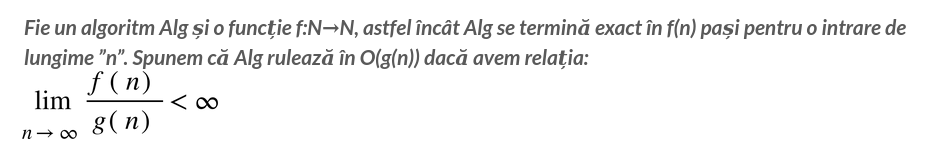
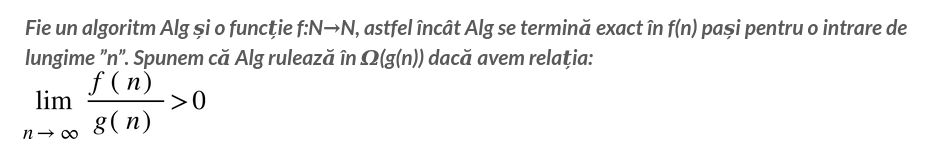
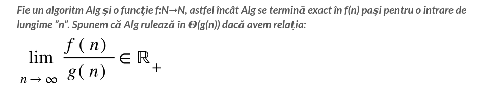
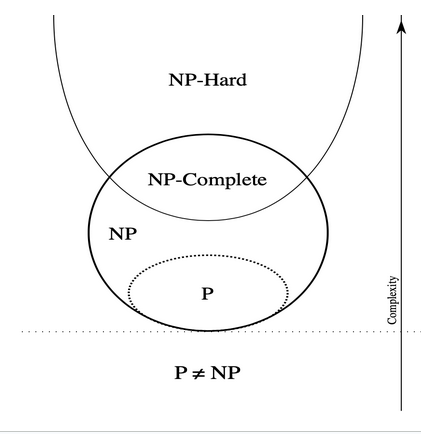
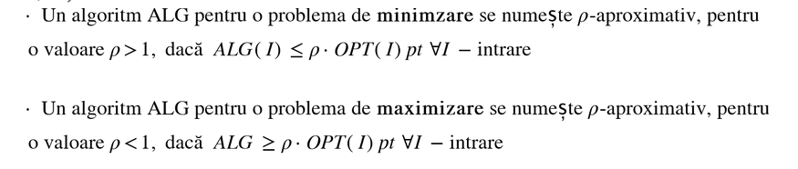
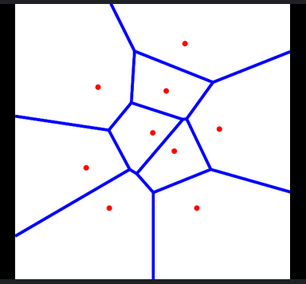
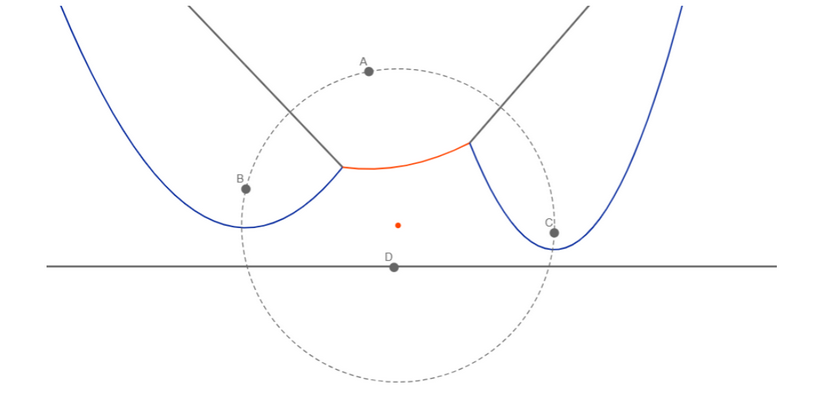
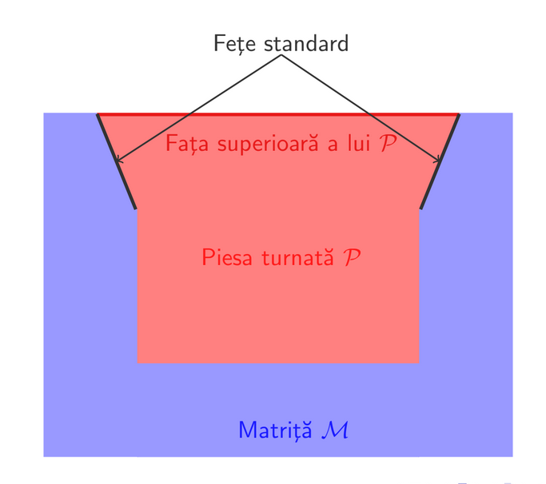
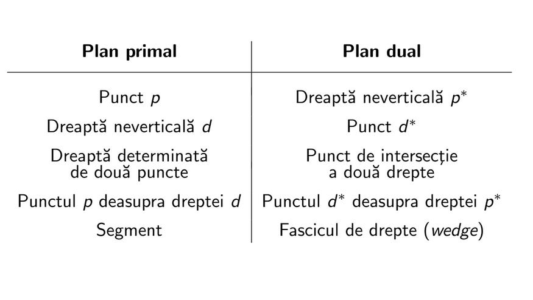
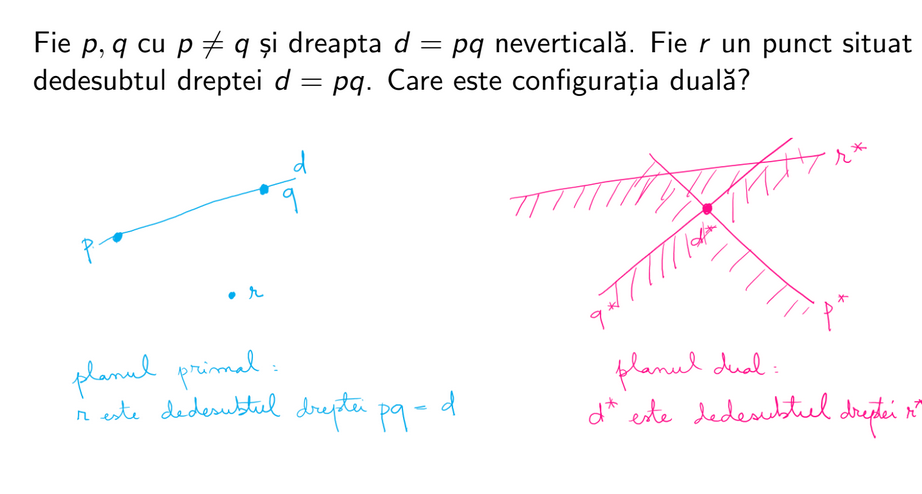

## Complexities and complexity classes

- The following complexity classes work only with **decidable problems**
- $P$ defines the problems solvable in polynomial time by a deterministic Turing Machine
- $NP$ represents the class of problems solvable in polynomial time by a non-deterministic Turing Machine $<=>$ a solution to the problem (the "yes" case) can be verified in polynomial time
- $NP-complete$ problems are a special type of $NP$ problems used to showcase that no solution can be found in polynomial time for a certain problem; any $NP - P$ problem can be converted into a $NP-complete$ problem in polynomial time by a **reduction** algorithm
- $NP-hard$ problems are the problems that either are not decidable or the solution cannot be validated in polynomial time; they include the $NP - complete$ problems because any $NP - P$ problem can be converted into an $NP-hard$ problem through a polynomial time algorithm
- 

## Abordarea problemelor grele (NP sau NP-hard)
- Pentru problemele pentru care nu avem destule resurse necesare sa le rezolvam optim, avem 2 posibilitati:
  - Algoritmii evolutionist: rulam un algoritm un timp rezonabil si luam cea mai buna solutie
  - Algoritmii $\rho$-aproximativi: alegem un algoritm care da o solutie ce este de cel mult $\rho$ ori mai proasta decat cea optima
- Astfel, pentru a le rezolva renuntam la una din urmatoarele 3 cerinte:
  - Solutia sa fie optima
  - Solutia sa fie generala
  - Solutia sa fie polinomiala

## Indicatii pentru demonstratia algoritmilor aproximativi

- Define **ALG**
- Asumpti in legatura cu **OPT** in functie de obiectiv (maximizare sau minimizare)
- Ask: When does this algorithm perform poorly?
- Ask: How much better could OPT do?
- Analizarea starii corespunzatoare actiunii curente / ultimei actiuni
- Sortare
- Demonstratii de racapitulat:
  - Knapsack
  - Load balancing
  - Vertex cover
  - TSP
  - Trucks and loads
  - Linear programming

## Algoritmii evolutionisti (genetici)
- Presupun executarea unor programe in mod repetat cu scopul de a obtine o solutie din ce in ce mai apropiata de ce optima
- Initial, dupa ce s-a stabilit intervalul $[a, b]$ se codifica populatia (**populatie** = mulţime de indivizi care trăiesc într-un mediu la care trebuie să se adapteze) initiala cu o precizie $p$ (adica se va imparti in intervale de lungime $\frac{1}{10^p}$, deci vor fi $(b - a)10^p$ intervale) pentru a se afla cromozomii (**cromozom** = mulţime ordonată de elemente (gene) ale căror valoare (alele) determină caracteristicile unui individ) fiecarui individ
- Dupa aceea, se executa programul si se aplica operatorii genetici in functie de probabilitate lor (**incrucisare** si **mutatie**)
- Ulterior, in functie de **functia de fitness** (măsură a gradului de adaptare la mediu pentru fiecare individ) se va selecta (proces prin care sunt promovați indivizii cu grad ridicat de adaptare la mediu) o generatie (etapa in evolutia populatiei) noua
- Selectia poate fi:
  - proportionala (bazata pe fitness)
  - elitista
  - turneu
  - bazata pe ordonare

## Algoritmii probabilisti
- Executia programului se bazeaza pe un set de numere alese aleator
- **Algoritmii Monte Carlo**: ruleaza in timp polinomial si ofera raspuns **probabil** corect
- **Algoritmii Las Vegas**: ruleaz **probabil** in timp polinomial si ofera raspuns corect
- **Algoritmii Atlantic City**: ambele combinate

## Sets of points in plan
- Testul de orientare presupune determinarea pozitiei unui punct fata de o dreapta, in sensul determinat de primele 2 puncte. Acesta se realizeaza cu determinantul de ordin 3 in care introducem coordonatele celor 3 puncte, la fel ca la determinarea coliniaritatii, doar ca aici daca valoarea este pozitiva, atunci e la stanga, daca e 0, atunci e pe dreapta, iar daca e negativa, atunci e la dreapta.
- Graham Scan este un algoritm de determinare a infasuratorii convexe pentru o multime de puncte in plan. Are 2 variante: varianta Andrew si varianta Javis' march.
- Pe scurt, varianta Andrew presupune alegerea unui punct care stim ca va fi pe infasuratoare (de obicei cel cu x-ul minim sau y-ul minim) si sortarea punctelor in functie de cel fixat, cu ajutorul testelor de orientare (dupa coordonatele polare).
- Varianta Javis' march presupune initial alegerea unui pivot, similar cu varianta Andrew, iar apoi determinarea punctului pentru care dreapta determinata de ultimul punct adaugat si acesta nu mai admite viraje la dreapta pe punctele ramase i.e. luam punctul "cel mai din dreapta" relativ la ultimul punct adaugat in infasuratoare. Acest "cel mai din dreapta" punct va fi introdus in infasuratoare si se va relua procesul pana cand ajungem la primul punct introdus.

## Poligoane si triangulari
- Fie $P$ un poligon. O **diagonala** a lui reprezinta un segment determinat de 2 varfuri ale poligonului si care este situat in **interiorul** acestuia.
- Problema: dorim sa aflam un numar estimativ de puncte pentru un poligon astfel incat din setul respectiv de puncte sa se poata trasa linii, care nu ies din poligon, catre toate punctele interioare poligonului i.e. punctele sa poate vedea tot interiorul poligonului.
- Idee din spatele rezolvarii acestei probleme reprezinta impartirea in triunghiuri i.e. realizarea unei **triangulari**.
- Pe baza acestei triangulari, putem realiza o 3-colorare a varfurilor fiecarui triunghi a.i. sa nu existe 2 puncte cu aceeasi culoare ce formeaza acelasi triunghi. De aici, putem amplasa "camerele" care sa "supravegheze" poligonul in toate nodurile colorate cu o anumita culoare aleasa la inceput. Cum avem $[\frac{n}{3}]$ triunghiuri, avem si $[\frac{n}{3}]$ "camere".
- Acum, ne ramane de determinat o triangulare pentru ca sa putem plasa "camerele". Acest lucru il vom realiza cu algoritmul de **Ear Clipping**. Intuitiv, acest algoritm presupune "decuparea" triunghi cu triunghi a poligonului, de la exterior la interior, ca o foaie de origami.
- Pentru asta insa trebuie sa stim algoritmic ce triunghi "decupam", iar aici avem nevoie sa clasificam varfurile in clasele urmatoare:
  - **Varf principal**: Un varf $V$ este principal $\equiv$ triunghiul determinat de el, succesorul si predecesorul sau nu contine puncte interioare
  - **Varf convex / concav**: Un varf este convex daca unghiul determinat de predecesor, el si succesorul lui este $\le \pi radiani$. Altfel, este **concav**.
- Pe baza notiunilor prezentate, definim o **componenta Ear** ca fiind un **varf principal si convex**. Similar, o componenta **mouth** este un **varf principal si concav**.
- Algoritmul este, astfel, urmatorul: se "decupeaza" cate un triunghi a carui varf principal este o componenta Ear (adica triunghiul determinat de el, succesorul sau si predecesorul sau), iar apoi se recalculeaza tipurile de varfuri pe noul poligon. Evident, suntem in $O(n ^ 2)$.
- Cum nu ne multimim cu aceasta complexitate, dorim sa o optimizam. Pentru asta vom introduce un alt concept: un **poligon y-monoton** este un poligon in care, considerand $V1$ varful cu cel mai mare $y$ si $V2$ varful cu cel mai mic $y$, $y$-urile varfurilor de pe drumul de la $V1$ la $V2$ si invers sunt strict descrescatoare sau strict crescatoare.
- Observam ca pe acest tip de poligon este mai usor de calculat algoritmul de **Ear clipping**, ca urmare noul obiectiv va fi impartirea unui poligon oarecare in poligoane $y$-monotone cat mai eficient (de exemplu sortam punctele si facem **line sweeping** i.e. folosim o dreapta de baleiere orizontala care traverseaza poligonul oarecare de sus in jos si ne formeaza poligoane y-monotone), iar apoi aplicarea algoritmului de **Ear clipping** pe fiecare din ele.
- Algoritmul de **Ear clipping** pe un poligon y-monton consta in parcurgerea varfurilor de sus in jos (ambele drumuri, si cel stang si cel drept) cu ajutorul unei stive si considerearea a 3 cazuri:
  - Cazul 1: Varful nou introdus este pe partea opusa ultimului varf din stiva
  - Cazul 2: Varful nou introdus este pe acelasi lant
    - Se sterg varfuri de pe lantul curent prin adaugarea de triunghiuri cu varful in punctul adaugat deja
    - Nu se sterg varfuri, de vreme ce punctul nou adaugat este "in afara"
- Cum stim sa impartim in poligon oarecare in timp $O(nlogn)$ in poligoane y-monotone, iar fiecare necesita $O(n)$ procesare, avem in final $O(nlogn)$ pentru determinarea triangularii si, implicit, a pozitionarii "camerelor".
- Totusi, metoda prezentata mai sus nu functioneaza mereu, deoarece nu putem realiza 3-colorari decat daca linia poligonala nu are autointersectii. **Linia poligonala** reprezinta linia care uneste mijloacele triunghiurilor (i.e. consideram triunghiurile ca fiind noduri, iar daca 2 se invecineaza au muchie intre ele; aceste reprezinta **graful dual**). Deci, daca linia poligonala nu are autointersectii, atunci graful nu are ciclu.

## Triangulari oarecare
- O triangulare a unei multimi oarecare de puncte reprezinta e o subdivizare a suprafetei convexe (date de infasuratoarea convexa) in triunghiuri astfel incat fiecare triunghi sa aiba varfurile intre punctele date.
- **IMPORTANT:** A nu se confunda cu triangularea unui poligon oarecare. Cele 2 corespund doar daca poligonul este convex.
- **Propozitie:** Fie $n$ puncte in plan si $k$ numarul de puncte de pe acoperirea convexa. **Orice triangulare a multimii are $2n - k - 2$ triunghiuri si $3n - k - 3$ muchii**.
- **Teorema lui Euler pentru un poligon: V - E + F = 2**
- Acum, fiindca lucram cu puncte aleatoare in plan, exista mai multe triangulari posibile pe o multime. Dintre acestea, dorim sa o alegem pe cea mai "convenabila". In practica, de cele mai multe ori e cea in care unghiurile poligoanelor sunt in general mai mari. Ca urmare, vrem obtinem o triangulare in care cel mai mic unghi generat de un triunghi care apartine acesteia este cel mai mare.
- Pentru a realiza algoritmic obiectivul de mai sus, analizam urmatorul caz: Avem un patrulater $ABCD$ (cu punctele in ordinea asta) si dorim sa vedem care e o diagonala mai buna: $AC$ sau $BD$. Pentru aceasta, avem nevoie sa comparam unghiurile generate de cele 2 diagonale si sa o alegem pe cea care ne da unghiul minim mai mare. Aceste calcule sunt echivalente cu a afla daca punctul $D$ se afla in cercul cercului circumscris triunghiului $ABC$ sau, dimpotriva, daca punctul $D$ este in interiorul cercului circumscris triunghiului $ABD$. A afla apartenenta unui punct la un astfel de cerc se realizeaza cu un determinant de ordinul 4, care daca este pozitiv, atunci punctul este in interior, daca este 0 atunci cele 4 puncte sunt conciclice, iar altfel este in exterior.
- Determinantul arata asa (se verifica daca punctul $D$ apartine lui $ABC$):
$
\Theta(A, B, C, D) = 
\begin{vmatrix}
x_A & y_A & x_A^2 + y_A^2 & 1 \\
x_B & y_B & x_B^2 + y_B^2 & 1 \\
x_C & y_C & x_C^2 + y_C^2 & 1 \\
x_D & y_D & x_D^2 + y_D^2 & 1
\end{vmatrix}
$

- **IMPORTANT:** Triunghiul $ABC$ din determinantul de mai sus trebuie sa fie un **viraj la stanga**.
- Implementand aceste verificari de **muchii legale / ilegale** in cadrul unui algoritm de triangulare obisnuit, obtinem la final o **triangulare legala**, care se apropie de **triangularea optima**. Mai mult, daca nu exista 4 puncte conciclice, atunci triangularea legala obtinuta este chiar cea optima.

## Diagrame Voronoi
- In multe situatii practice, fiind date niste puncte in plan, dorim sa impartim o harta in suprafete (numite **celule Voronoi**) astfel incat fiecarei suprafete sa-i corespunda un punct dat (puncte numite **situri**), iar pentru toate punctele (puncte care nu sunt date initial) de pe acea suprafata, punctul corespunzator suprafetei sa fie cel mai apropiat dintre cele date.

- Evident, fiecare suprafata este o multime convexa si este determinata de o intersectie de semiplane. Pe scurt, fie 2 puncte $A$ si $B$ in plan si fie $AB$ segmentul care le leaga. Mediatoarea acelui segment imparte planul in 2 semiplane, fiecare reprezenta suprafata corespunzatoare celor 2 puncte. De asemenea, muchiile ariilor sunt fie segmente, fie semidrepte.
- **Propozitie**: Fie $n$ situri. Atunci numarul de varfuri al diagramei este $\le 2n - 5$, iar numarul de muchii este $\le 3n - 6$.
- Cum se leaga aceste lucruri de triangulari? Pai daca cream graful dual al diagramei Voronoi, respectiv daca consideram siturile ca fiind noduri, iar muchiile ca existand intre 2 noduri ddaca celulele Voronoi corespunzatoare sunt vecine, obtinem o structura similara cu diagram Voronoi, doar ca de data asta avem triunghiuri, si nu poligoane convexe. Aceasta reprezinta triangularea **Delaunay** pentru o diagrama Voronoi data.
- Un aspect important e ca cele 2 structuri sunt duale, adica una se poate obtine din celalalta. Pentru completitudine, diagrama Voronoi se obtine din triangulare trasand mediatoarele muchiilor tuturor triunghiurilor.
- Un alt aspect important este o triangulare este legala ddaca este o triangulare Delaunay (demonstratie schita: mediatoarele se unesc in centrele cercurilor circumscrise triunghiurilor, adica se respecta proprietatea determinantului acela de ordin 4).
- De asemenea, numarul de semidrepte ale unei diagrame Voronoi este egal cu numarul de puncte de pe frontiera acoperirii convexe. Semidreptele sunt dreptele care nu se mai intersecteaza cu nicio alta dreapta.

#### Ideea
- Ideea algoritmului de determinare a unei diagrame Voronoi este destul de complexa si implica mai multe observatii (vedeti un suport vizual [aici](https://andreihodoroaga.github.io/geometric-algorithms/voronoi-diagram)):
  - Ideea generala presupune utilizare unei drepte de baleiere (**line sweeping**) pornind din stanga spre dreapta, Totusi, atunci cand intalnim un punct care ar fi o intersectie de segmente din diagrama Voronoi, pentru a-l putea reprezenta, avem nevoie si de siturile aflate dupa el, prin care dreapta de baleiere inca nu a trecut. Ca urmare, abordarea nu merge
  - Pentru a rezolva problema, in loc sa ne uitam la toate punctele din jur si sa estimam pe unde ar fi punctul de intersectie (ceea ce nu e eficient deloc), am putea sa ne folosim doar de informatiile pe care le avem i.e. doar de punctele prin care am trecut. In jurul lor construim parabole a caror interior defineste punctele care sunt mai apropiate de el decat de alte situri (deci nu mai avem ce umbla acolo)
  - Dar acum intervine o noua problema: parabolele siturilor se vor intersecta, formand o linie alcatuita din mai multe varfuri de parabole ce se numeste **beach line** (se aseamana cu modelul lasat de valuri pe plaja). De asemenea, un punct de pe curba parabolica este egal departat de situl care determina arcul de parabola si dreapta de baleiere.
  - Formal, presupunand ca dreapta de baleiere este la $y = 0$, iar situl $P_i$ situat deasupra lui $d$ (adica a fost deja parcurs) are coordonatele $(x_i, y_i)$, atunci locul geometric egal departat de dreapta $d$ si situl $P_i$ (care este o parabola), are ecuatia:
$y = \frac{1}{2y_i} x^2 - \frac{x_i}{y_i} x + \frac{x_i^2 + y_i^2}{2y_i}.$
  - Un alt aspect important este faptul ca in orice moment, punctele aflate la intersectia unor parabole (care se mai numesc si **puncte racord**) fac parte din laturile celulelor Voronoi, iar ele formeaza latura, punct cu punct, odata cu miscare dreptei de baleiere, pana cand liniile se intalnesc, formand un varf a unei celule Voronoi (convexe).
  - Pe drumul dreptei de baleiere se intampla mai multe evenimente care declanseaza anumite operatii:
    - **Site event**: Atunci cand dreapta de baleiere a intalnit un sit, se va crea o noua parabola care se va adauga la **beach line**
    - **Cicle event**: Atunci cand dreapta de baleiere atinge un cerc determinat de orice 3 puncte procesate pana atunci pentru ultima data (adica il atinge tangential, apoi urmand sa treaca de el) cel putin una din parabole va fi eliminata (parabola respectiva va fi absorbita de cele 2 parabole vecine si se va forma un varf din diagrama Voronoi). Algoritmic, se vor testa toate tripletele consecutive de arce pentru a se stabili care din ele va fi absorbit de vecinii sai. Un aspect important este ca e posibil ca unele parabole sa nu se intersecteze daca, pana se ajunge la finalul cercului determinat de ele, se va intalni un alt punct in care se vor bloca parabolele. Procesul de blocare se cheama **splitting**.

#### TODO: Algoritmul

- Pentru implementarea acestui algoritm se vor folosi diverse structuri de date speciale pentru a optimiza executarea:

## Complexitatea algebrica
- Complexitatea algebrica a unui algoritm se refera la complexitatea calculelor implicate pe parcursul lui.
- De obicei, este exprimata sub forma de polinoame, functii cu polinoame, rapoarte de polinoame etc.

## Intersectii de segmente
- Se poate afla daca 2 segmente, $AB$ si $CD$, se intersecteaza folosind testul de orientare. Pe scurt, vom verifica daca $C$ si $D$ se afla de o parte si de alta a segmentului $AB$ si reciproc pentru $CD$.
- Pentru a determina punctul de intersectie dintre 2 segmente se va scrie punctul de intersectie in raport cu cele 2 segmente (in functie de 2 necunoscute), iar apoi se va forma un sistem cu 2 ecuatii si 2 necunoscute ce se va rezolva cu determinanti, rezultand intr-o complexitate algebrica de $\frac{polinom de grad 3}{polinom de grad 2}$ (vezi formule curs 12).
- Dar cum facem daca dorim sa aflam toate intersectiile dintre toate segmentele dintr-o multime?
- Pentru cazul 1D, sortam extremitatile si la fiecare capat din stanga punem identificatorul segementului respectiv in sir, iar la fiecare capat din dreapta trecem prin lista de identificatori si anuntam intersectii cu toti acestia.
- O prima idee pentru cazul 2D ar fi sa folosim o dreapta de baleiere orizontala. Pe scurt, vom trece de sus in jos prin toate segmentele, actiuni realizandu-se doar atunci cand intalnim un capat al unui segment, sau un punct de intersectie
- Ca urmare, ideea algoritmului este urmatoarea:
  - Pentru inceput, se insereaza intr-un max-heap toate capetele segmentelor, iar apoi se proceseaza segmentele in ordinea punctelor din max-heap (segmentele sunt sortate in functie de y apoi x) care reprezinta evenimentele noastre si care sunt de 3 tipuri: inceput de segment, final de segment si punct de intersectie.
  - Dupa aceea, in momentul in care detectam un eveniment care este punctul de inceput al unui segment (i.e. capatul de sus), il inseram intr-un balanced BST in care se afla punctele inserate pana atunci, impreuna cu identificatorul segmentului, sortate in functie de x, si aflam vecinii din stanga si din dreapta. Pentru fiecare din acestia 2, vom calcula daca se intersecteaza cu segmentul curent procesat **sub dreapta de baleiere**, iar in caz afirmativ, introducem in max-heap si evenimentul determinat de punctul de intersectie. Dupa asta, mai stergem punctul de intersectie determinat de punctele vecine lui (daca exista) - il stergem pentru ca il vom adauga ulterior.
  - Daca evenimentul curent este punctul de final al unui segment, atunci vom sterge segmentul si vom verifica daca vecinii lui se intersecteaza **sub dreapta de baleiere**.
  - In final, daca evenimentul curent este un punct de intersectie, se va raporta acesta, iar apoi se vor interschimba aceste 2 segmente in arborele balansat ce stocheaza punctele (asta, deoarece avem nevoie sa mentinem ordinea segmentelor intersectate de dreapta de baleiere). Ulterior, vom verifica daca segmentul mutat la dreapta se intersecteaza cu vecinul lui de la dreapta, iar cel mutat la stanga cu vecinul de la stanga. Similar cu primul caz, intersectiile dinainte de swap-uri ce implicau punctele interschimbate vor fi eliminate.
  - Aplicand pasii acestia de sus in jos, in functie de evenimente, determinam toate intersectiile segmentelor in complexitate $O((n + k)logn)$

## Intersectii de subdiviziuni planare
#### Ideea generala
- O subdiviziune planara a unui plan reprezinta o impartire a respectivului plan in suprafete (nu neaparat conectate). Astfel, o subdiviziune este formata dintr-o multime de varfuri, o multime de muchii si o multime de fete.
- In practica, exista multe cazuri cand, avand o subdiviziune si dorim sa o suprapunem peste o alta diviziune pentru a analiza anumite informatii (eg.: harta cu rauri peste harta cu judete).
- Pentru a reprezenta o subdiviziune planara avem nevoie de o structura de date care ne permite stocare acestor componente a diviziunii si a efectua operatii eficiente pe acestea. O astfel de structura este **Doubly Connected Edge List (DCEL)**.
- **IMPORTANT:** In DCELs muchiile indirecte din reprezentare sunt impartite in 2 **semi-muchii orientate** (una pentru fiecare sens).
- Aceasta structura de date presupune stocare urmatoarelor date, in functie de componenta:
  - Pentru varfuri avem nevoie sa stocam **coordonatele** si un **pointer** catre o muchie care pleaca din acest varf.
  - Pentru muchii vom stoca urmatoarele informatii: **originea semi-muchiei (origin)**, **muchia geamana (twin)**, **fata incidenta** (fata din stanga muchiei in sensul origine - destinatie), **next** - muchia urmatoare in sensul orar de parcurgere, **prev** - muchia precedenta in sensul orar de parcurgere
  - Iar pentru fete vom stoca urmatoarele: **un pointer** catre o semi-muchie care formeaza frontiera externa (sau **nil** daca este nemarginita), **o lista de pointeri** catre semi-muchii care formeaza frontiera interna - cate una pentru fiecare gol, **data** - informatii extra despre fata respectiva (culoare, nume etc.)

#### TODO: Algoritmul de suprapunere
- Ideea generala a algoritmului de suprapunere a 2 subdiviziuni planare reprezentate de DCEL-uri este sa gasim intersectiile segmentelor corespunzatoare muchiilor, iar pe baza lor sa construim noile semi-muchii si fetele aferente.

## Turnarea pieselor
- Dorim sa determinam modul de reprezentare (forma) a unui poligon intr-un alt poligon (**matrita**, de obicei patrat indeajuns de mare) astfel incat sa se poate misca de-a lungul unei directii fara sa iasa din forma stabilita folosind una sau mai multe translatii.
- Partea prin care se face extragerea se numeste **fata superioara**, iar restul fetelor sunt **fetele standard**.

- Conditia de a extrage un poligon dintr-o matrita este echivalenta cu a verifica daca unghiul format de normalele tutoror fetelor cu directia de extragere este cel putin $90\degree$. Formal, acest lucru este echivalent cu a ne transpune in 3D si a calcula $\langle \vec{\nu}(f), \vec{d} \rangle \leq 0 \iff  \nu_x \cdot d_x + \nu_y \cdot d_y + \nu_z \cdot d_z \leq 0$, unde $\vec{\nu}(f)$ este norma fetei $f$, iar $d = (d_x, d_y, 1)$ fiind directia de deplasare. Aceasta ultima forma, insa, reprezinta un semiplan, deci am redus problema initiala la a afla valorile directiei, $d_x$ si $d_y$, dintr-un sistem de inegalitati de gradul 2, toate reprezentand semiplane (facem calculul de mai sus pentru toate fetele).
- Ca urmare avem urmatoarea concluzie: exista o directie admisibila ddaca avem solutie pentru sistemul de inegalitati
- Acum, este clar ca o intersectie de semiplane reprezinta un poligon **convex** (posibil degenerat). Totusi, nu toate semiplanele contribuie la aceasta intersectie - unele sunt incluse in altele.
- Pentru a trece mai departe trebuie introdus un concept: **dualitatea**. Intuitiv, dualitatea reprezinta un mod de a scrie diferit, dar in acelasi timp echivalent, anumite lucruri (de ex.: graful dual unui poligon triangulat).
- In aceasta situatie, dorim sa transformam o dreapta intr-un punct, si un punct intr-o dreapta. Acest lucru se realizeaza astfel: pentru punctul $P(p_x, p_y)$ avem dreapta $y = p_x * x - p_y$. Aceasta este dreapta $p^*$. Analog se transforma o dreapta in punct.

- Pe baze celor 2 imagini prezentate tragem urmatoarea concluzie critica: Pentru a determina ce segmente fac parte din frontiera inferioara a intersectiei de semiplane in planul primal, trecem in planul dual, si gasim frontiera superioara a infasuratorii convexe pentru punctele ce in primul plan reprezentau ecuatiile semiplanelor. Analog pentru determinarea frontierei superioare intersectiei de semiplane in planul primal.
- Dupa cate se poate observa am redus o problema de inegalitati de gradul 2 la a determina o infasuratoare convexa, deci putem afla spatiul solutiilor in $O(nlogn)$. Ba mai mult, putem afla cu aceeasi complexitate punctul maxim (fie cel mai sus, fie cel care maximizeaza x + y etc.) care este solutie a sistemului de inegalitati.
- Totusi, pentru a afla un minim/maxim, aceasta metoda presupune mai multi pasi si devine anevoioasa de implementat. Am dori sa folosim tot o metoda care se bazeaza pe intersectii de semiplane, insa nu necesita alti pasi.
- Un algoritm in ideea asta este urmatorul: Adaugam constrangerile una cate una (adica semiplanele). Astfel, vom avea 2 cazuri:
  - Punctul optim (maxim / minim etc.) de pana atunci se afla in planul curent introdus (caz in care nu facem nimic)
  - Punctul optim nu se afla in plan, caz in care noul punct poate sa nu existe (atunci multimea intersectiilor este vida si nu avem solutie) sau se afla la intersectia dintre planul curent cu unul din planurile precedente. Deci, avem un sistem de inegalitati de gradul I din care dorim sa aflam valoarea optima (trebuie sa aflam x-ul optim astfel incat punctul sa fie in intersectie, y-ul il aflam din ecuatia semiplanului curent)
- Analizand probabilistic algoritmul, ajungem la complexitatea de $O(n)$ in medie

## Localizarea unui punct intr-o harta
- benzi verticale -> trapezuri -> harti trapezoidale (mentinere 2 laturi si abscisele corespunzatoare liniilor verticale) -> arbori de cautare -> algoritm de inserare segment
- cautare drum in harta -> graful dual