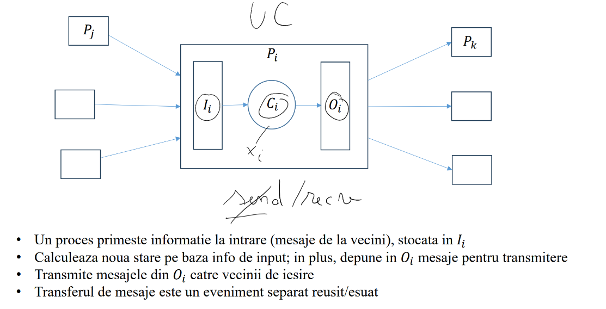
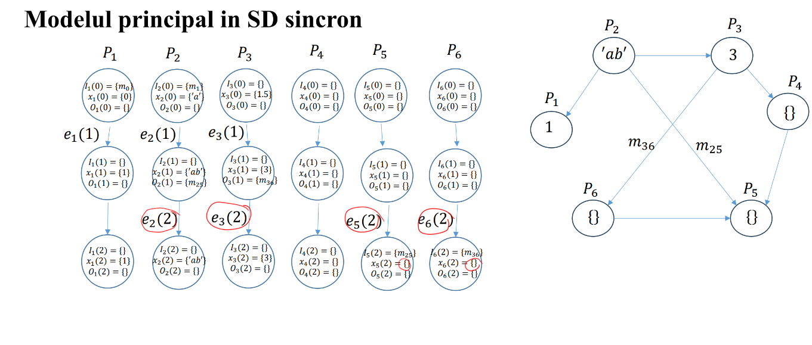
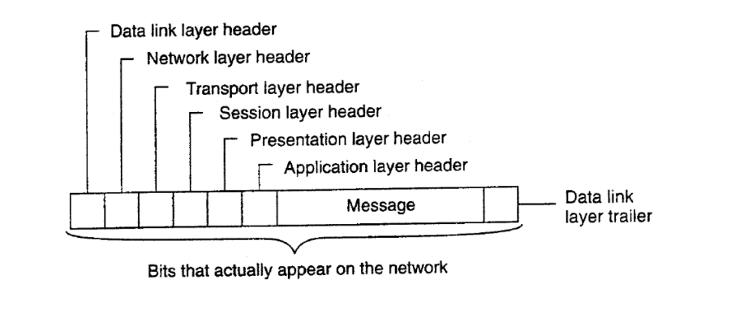
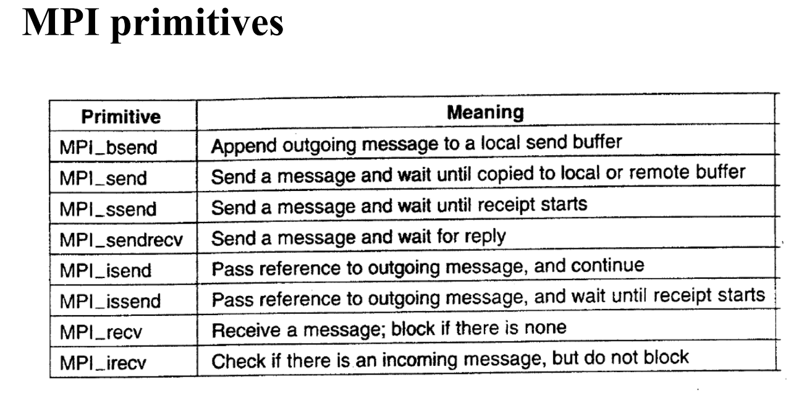
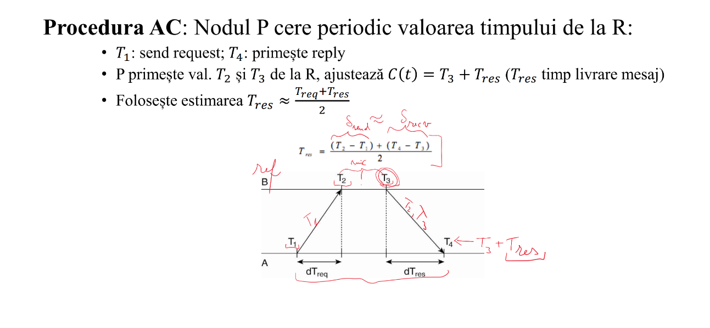
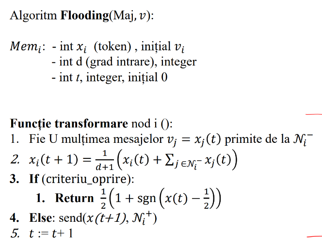

## Introduction

**Common System Architectures for Processes**
- Client-Server
- Peer to peer (P2P)
  - Structured: Ring (circular), Tor (table), Hypercube, El Capitan's
  - Unstructured: robots networks (communication using edges)???

**Definition**
- A distributed system is a system composed from autonomous processes / nodes that communicate within a network.
- Every node has just a local limited knowledge of the system state
- There is no system clock since it cannot be synchronized perfectly between the nodes
- No shared memory
- Nodes are autonomous and heterogeneous

**Process Model**
- A process is composed of some Input data that comes from a set of inward neighbours and some Output data for outward neighbours



- Example models: Rendezvous, Majority Vote



- Trajectory in safe networks vs unsafe networks


## Communication

- In a distributed system the communication between the processes is not trivial and it requires some models to follow.
- Before this, it's important to firstly present what are the assumed rules of such a inter-node communication:
  - The nodes are physically connected
  - The sender chooses the characteristics of communication (language, alphabet etc.) and sends the message encoded
  - The receiver decoded the message, understand its style and execute the needed operations
- To make sure the receiver understands the message, some standards for the communication should be decided; in technical terms, they are called **protocols**



- Some such communication protocols are [**UDP**](https://en.wikipedia.org/wiki/User_Datagram_Protocol) and [**TCP**](https://en.wikipedia.org/wiki/Transmission_Control_Protocol)
- Most of the models presented below consist of some interfaces with a set of functions call **primitives**. These functions can be blocking or non-blocking.


### Message Communication: Single Process Multiple Data (SPMD)

- SPMD model assumes we have a process that we want to run on every node, but each node has its own data stored locally different to others
- To solve this issue, we have to create the program so that it can adapt its behaviour depending on the running node or its data
- This information is gathered at the network level, using the **Message Passing Interface** that provides some utils (called **primitives**) to access certain information like the rank (**MPI_rank**) or do some actions like send a message and wait for reply (**MPI_sendrecv**); besides this, the indexing is done at runtime



- Example: initialize a vector of size n, where the m'th element is 1 and the rest are 0s. Solution: We have to divide the array into processors and then set using `/` and `%` the m'th element.
- In this model, the only communication method is, obviously, the messaging. This is made possible by the use of 2 functions: **send** and **recv** (receive).


### Persistent Message Communication: Message Queuing System (MQS)

- The principle of this model of communication is that messages are stored in a queue before being processed by the nodes, similar to a post box
- Primitives: **Put** (put a message in a queue), **Get** (get a message from my queue, or block if there is no message in it), **Poll** (like **get** but non-blocking), **Notify** (is called automatically when a message is appended in some node's queue)


### Collective Communication: Clocks

- Talking about a distributed system, the clocks are usually delayed. Even though you use an atomic clock, the starting time is not propagated instantly and, thus, the nodes cannot synchronize propely, especially if some nodes fail for some time exactly in that moment
- A good way to solve this is to use an external absolute reference, like **Universal Time Coordinator (UTC)**, that is **external synchronization**
- There are also some **internal synchronization** algorithms, most of them based on the voting principle

**Internal Sync: Cristian's Algorithm** (da ba, era roman)

- [Wikipedia link](https://en.wikipedia.org/wiki/Cristian%27s_algorithm)
- In short, looking at the below image, this algorithm wants to synchronize the times between the 2 nodes by taking the mean between the requests' durations to handle easily the various types of delay (B's time is less or bigger than A's)
- Due to the simplicity of this algorithm and the low absolute errors it provides, it was implemented in the **Network Time Protocol (NTP)** networking protocol in order to synchronize various computers across a network




**External Sync: Berkeley Algorithm**

- In the beginning a leader is elected by the system that, among other operation, while it is alive, it sends its time to the other nodes which make the necessary procedures to adapt to it


## Synchronous systems

### Algorithms

**Overview**

- A synchronous distributed algorithm defines a set of operations executed in multiple rounds (depeding on the time $t$) within system nodes to accomplish some task.
- Suppose a node's local state is $x_i(t)$. Using the SPMD format (presented above), we define across the system a function $f_i(k)$ so that the transformation of node $i$ depending on its neighbours is $x_i(t + 1) = f_i(x_i(t))$
- To better understand how a synchronous algorithm works, consider the problem of finding the mean of a set of numbers, each number being assigned to each node. On each iteration, a node chooses another (free) node and, through SPMD model, they reach a consensus regarding the mean between the numbers they possess, such that, in the end they both have the same number. After repeating the same process a number of iterations (which should be less than some preset number $T$), we get a system with nodes whose numbers are much closer to the real mean than before.

**Leader Election**

- Due to the inefficiency of the approach from the mean problem, we try to find another way, more straightforward to accomplish this: centralization.
- Basically, we elect a leader and that is the node that will broadcast to the others the correct answer
- How does a leader gets elected (by convention, the one with the greatest $id$ is the leader)? Each nodes looks around its inward nodes and decides if he is the leader or not based on the gathered ids. Then it broadcasts the result to the outward nodes.
- This method is pretty ambiguous and depends a lot on the topology of the system (how the system looks). For example, in a ring (circular) topology, this algorithm is trivial: with 1 traversal at least 1 node has the leader information and with another traversal everyone gets this information (implementation is also trivial since you only need to handle only 2 special cases: the first node and the last node; the others behave the same)

**Flooding Algorithm (Lann-Chang-Roberts aka LCR)**

- The following pseudocode describes the best this algorithm (it takes place in a ring topology):
```
Funcție transformare nod i ():
- recv(recv_id, left);
- If (recv_id > id):
  send_id := recv_id;
- Else If (recv_id == id): status = leader;
- Else If (recv_id < id): send_id := NULL;
- send(send_id, right);
```

- Time complexity: $O(n^2)$ because every node sends a message by the time it receives a better message
- Generalization: strongly connected graph and an iteration limit to graph's diameter

**Rendezvous Problem**

- A **moving agent** is a dynamic non-linear system described by $(X, U, X_0, f)$ where $X$ is state domain of dimension $d$, $U$ is input space, $X_0 \subset X$ is the set of the initial states and $x(t + 1) = f(x(t), u(t))$
- An $r$-proximity graph of a set of n-dimensional points is a graph formed with the following rule: every point is a vertex and 2 vertices have a bidirectional edge between them iff the distance between them is at most $r$
- The goal is to bring all the agents (initially defined by their initial positions) to a common point ("meeting point")
- The idea behind solving this problem is calculating the average between an agent position and its neighbours and move towards it

**Majority Vote Problem**

- A set of agents have to vote for an action using their binary states. The task is to propagate within the system the majority's decision
- A way to solve this is to choose a leader and then organize a centralized version of the voting using local processing in the leader and broadcasting the results
- Another way is very similar to the methods above: gather neighbours data and compute locally the voting result; after some number of iterations the result will be broadcasted throughout all the system
- A very important side note here is that this method is dependent of the topology; a **majority consensus computer** is such a topology that allows efficient computing of majority voting




## Flooding Consensus Technique

- Suppose again the problem of finding the voting majority and the algorithm above. Let's firstly try to generalize it and then formalize it.
- Formula of the answer (average) -> matrix transformation -> equation formalization -> topology and matrix
- Eigenvalues vs Eigenvectors -> find the consensus value by computing the eigenvalues of topology matrix $A$


## Faults

- Types of Faults: Crash, Omission, Crash-Recovery, Byzantine

### Crash Faults

- FloodSet s for Crash type algorithms -> at least s + 1 iterations (s is the number of faulty processes - they do not recover)
- Assumptions: s is chosen such that it doesn't disconnect the graph

### Byzantine Faults

- Byzantine Flood Algorithm
- n > 3s in order to detect the byzantine faults
- the minimum required number of steps to know that a consensus is established is n / 2 + s + 1, where s is the allowed number of malicious processes

## Asynchronous Systems

- Causal Order in an async system
- Logical clocks
- Vector clocks and detecting ordering issues

### Distributed System with Shared Memory

- **Consistency**: strict, sequential, causal, eventful
- **Algorithms**: Remote Write, Local Write
- **Mutual exclusions**: Centralized, Distributed (Ricard-Agrawala, Token Ring)