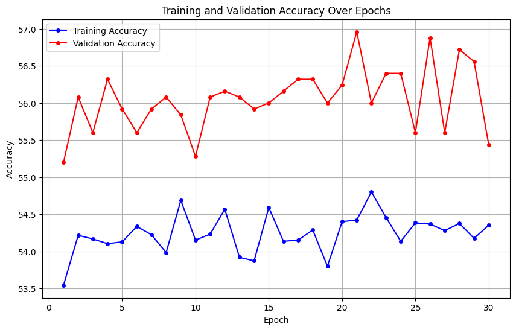
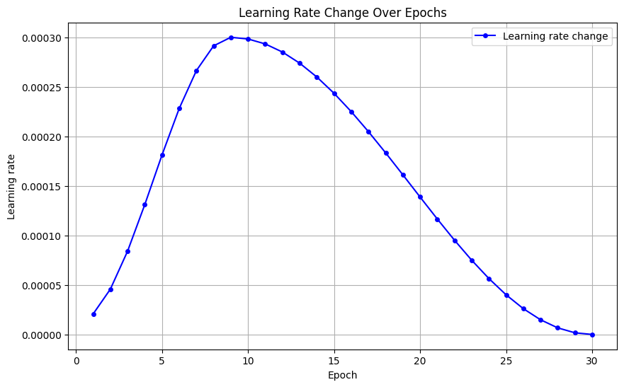

## Modelul 1: CNN
Dintr-o scurta documentare pe internet am aflat ca cele mai bune modele pentru clasificarea de imagini se bazeaza pe CNN-uri. Ca urmare am decis sa creez o astfel de retea.  
Pentru inceput, am facut o preprocesare pe imaginile date astfel incat sa aiba dimensiunea de 3x80x80 pentru ca modelul sa poata lucra mai usor cu imaginile, dar in acelasi timp sa aiba indeajuns de multe date din care sa invete. Tot pe partea de preprocesare am normalizat datele si le-am augmentat pentru a crea putina diversitate in setul de date astfel incat modelul sa nu faca overfitting. De asemenea, folosind prea multa augmentare, antrenarea modelului pentru 1 epoca dura cam 20s pe un L4 GPU fara prea mari diferente, ca urmare am considerat sa nu augmentez prea puternic datale. In imaginea urmatoare se poate observa antrenarea modelului fara vreo augmentare. Se evidentiaza cu usurinta overfitting-ul.  

Legat de data loadere, am folosit batch-uri de cate 32 pentru train si de 64 pentru validation.
Structura retelei consta din 5 straturi de dimensiuni crescatoare: 16, 32, 64, 128, 256. Fiecare astfel de strat are cate un strat de Batch Normalization pentru a preveni overfitting-ul si a regulariza mai puternic imaginile, iar la final am un strat de global pooling pentru a regulariza si mai puternic. Pe langa acestea, am folosit Xavier initialisation pentru ca train loss-ul si validation loss-ul sa inceapa convergenta spre 0 cat mai din timp.  

Pe partea de antrenament, am folosit CrossEntropyLoss ca functie de loss deoarece se potriveste mai bine pentru clasificarea imaginilor intr-un numar mic de categorii cum este acesta. Am folosit de asemenea Adam ca optimizer, deoarece am observat performante mult mai bune cu el decat cu SGD (chiar si cu momentum). In figura urmatoare se poate observa performanta unui SGD cu `0.9` momentum si `0.001` weigth decay.

Pentru learning rate, am folosit un OneCyle Scheduler pentru a gasi learning rate-ul potrivit pentru inceput (considerand cazul cand este neobisnuit de mare si pentru a evita minimele locale care nu sunt globale), urmand ca in cele din urma sa scada pe masura ce modelul a gasit un minim local potrivit. Desi pare destul de ineficient, acuratetea cu aceasta metoda a fost cea mai buna.

In final, doresc sa prezint acuratetile finale ale modelului, precum si loss-urile cu toti hiperparametrii si arhitectura prezentate mai sus, ce se pot observa si in cod.

## Modelul 2: Feedforward Neural Network
Pentru al doilea model am decis sa folosesc o retea neurala simpla, deoarece am observat pe parcursul laboratoarelor ca se comporta foarte bine in practica pe imagini.  
Am definit-o initial cu 2 straturi ascunse, ambele cu cate 512 neuroni pe strat. Preprocesarea datelor am lasat-o ca la modelul anterior, de vreme ce a mers decent pe acesta, iar modificarile ulterioare nu avut prea mare efect.

Din graficele obtinute, am observat ca reteaua nu invata prea bine, dupa 30 de epoci avand 20% acuratetea, iar confusion matrix avea valori doar pe coloana 4. Ca urmare, am decis sa scad numarul de neuroni de pe straturi la 100. Asta a dus la acuratetea de 50%.

Urmatoarea optimizare a fost sa adaug inca un layer cu 100 de neuroni. Asta a mai imbunatatit putin modelul.

Aplicand inca o optimizare adaugand un batch normalization. S-au mai observat cateva imbunatatiri, dar si faptul ca modelul a inceput sa faca overfitting.

Ulterior am decis sa adaug mai multe straturi de dropout si sa micsorez numarul de neuroni la 50. Apoi am adaugat niste Xavier initialisation, pentru a converge mai repede la rezultatele dorite (modelul se antreneaza timp de 30 de epoci). La final am introdus un adam optimizer si un adam scheduler. Toate acestea insa nu au adus optimizari prea semnificative, semn ca trebuie analizata mai bine structura retelei mai puternic.

Ca ultima optimizare, am eliminat stratul 4 din retea si am pus cate 100 de neuroni pe straturi. Totusi, nu am observat nicio imbunatatire semnificativa.

