# Reprezentarea cunostintelor

### Notiuni generale
- Programul reprezinta un **agent inteligent**
- In rezolvarea unei probleme agentul realizeaza mai multe etape:
  - **Formularea scopului**
    - determinarea setului de **scopuri** (setului de stari destinatie)
  - **Formularea problemei**
    - determinarea **spatiului starilor** si **actiunilor** (nodurilor si muchiilor arborelui corespunzator problemei) care trebuie luate in considerare
    - definirea **starii initiale**
    - **multimea operatorilor**: reprezinta actiunile ce trebuie considerate pentru a ne muta dintr-o stare oarecare
    - **testul scop**: poate fi o conditie de apartenenta, de verificare etc. a starii curente pentru a apartine multimii de stari scop
    - **functia de cost a unui drum**: suma costurilor (individuale) care compun drumul
    - **IMPORTANT**: Pentru problemele cu mai multe stari initiale, starile din acest caz vor forma multimi de stari, iar problema se va adapta corespunzator (intuitie: **DFA -> NFA**)
  - **[Cautarea](#cautarea)**
  - **Executia**: la final, atunci cand au fost obtinute toate solutiile, se va executa actiunea care ajunge in cea optima si se va relua procesul

### Cautarea
- procesul de decizie al agentului se bazeaza pe examinarea starilor in care poate tranzitiona; acest proces se numeste **cautare**
- cautarea se bazeaza pe o **strategie de cautare**, care trebuie sa indeplineasca **completitudinea**, **complexitatea timpului**, **complexitatea spatiului**, **optimalitatea** (Orice algoritm care garantează găsirea unui drum optim la scop este un **algoritm admisibil**.) (ex.: considerarea solutiei cu cea mai mica estimare)
- pentru acest pas se va construi un **arbore de cautare** pentru a determina **drumurile** in **spatiul starilor**
- **IMPORTANT**: arborele de cautare este format din structuri de date numite **noduri**, iar spatiul starilor este alcatuit din **stari** ce reprezinta configuratii ale mediului; de asemenea, 2 noduri pot stoca informatia aceleiasi stari
- Structura de date ce defineste nodurile trebuie sa stocheze urmatoarele informatii:
  - starea referita
  - parintele
  - operatorul folosit pentru a se genera nodul
  - adancimea nodului
  - costul drumului de la starea initiala pana la nod
- In timpul cautarii, exista mai multe noduri care doresc a fi extinse (**frontiera**), ca urmare avem nevoie de o structura de date pentru a realiza selectia celui mai bun nod

### Cautarea best-first
- Fie o functie euristica $f$ ce reprezinta rezultatul evaluarii unei stari, numar real, bazat pe informatii specifice domeniului in care s-a formulat problema
- La fiecare pas se va alege nodul cu functia euristica cea mai mica si se va extinde cu toti succesorii lui
- Totusi, in aceasta maniera nu vom lua in considerare drumurile cu costul mai mic dar cu o functie euristica mai mare
- Ca urmare, $f$ va fi formata din suma dintre $g$ si $h$, unde $g(u)$ reprezinta costul minim de la starea initiala la nodul $u$, iar $h(u)$ este functia euristica de mai sus, adica costul minim al unui drum de la $u$ la un nod scop
- In imagine, se va prezenta un algoritm de cautare care poate fi particularizat cu BF, DF sau best-first (deci si cautare informata si neinformata), numit **GraphSearch**
- **IMPORTANT**: daca spatiul starilor nu este arbore, atunci pot aparea cicluri; ele trebuie detectate in pasul 6
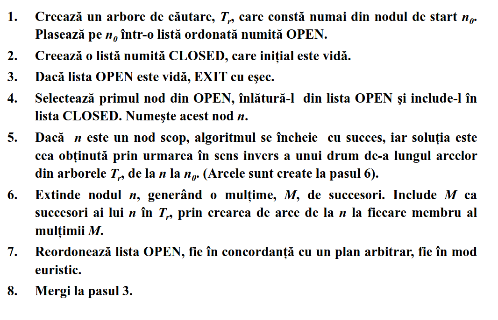

### A*
- Algoritmul A* este o particularizare a acestuia, cu mentiunile ca acea cautare este de tipul best-first, iar nodurile vor fi ordonate in coada in functie de costurile lor
- De asemenea, $f(n) = g(n) + h(n)$, unde $f(n)$ reprezinta costul minim al unui drum de la start la un nod scop, $g(n)$ este drumul de cost minim de la start la $n$, iar $h(n)$ este costul minim efectiv de la $n$ la un nod scop
- Cum nu putem prezice viitorul, definim o functie $h'(n)$ ce are rolul de a oferi o **estimare** pentru $h$, $g'$ ca fiind $g$-ul gasit **pana la pasul curent** din parcurgere si $f'$ distanta minima **pana acum** de la start la un nod scop
- Ca urmare, avem ca $f'(n) = g'(n) + h'(n)$
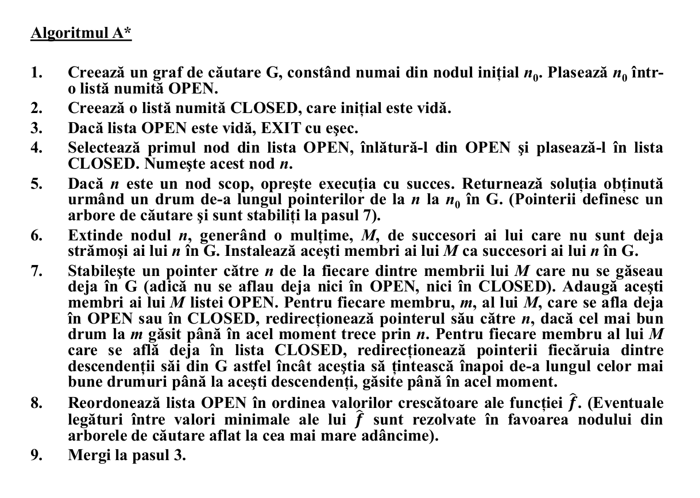
- A* este un algoritm complet, admisibil si optim.
- Pentru ca A* sa fie admisibil, avem nevoie de 3 conditii:
  - $h'(n) \le h(n)$
  - orice nod are un numar finit de succesori
  - toate costurile sunt pozitive
- Daca $h'(n) \le h(n) \space \forall n$ atunci $h$ este o **euristica admisibila**
- Daca $h(n) \le cost(n, succ) + h(succ)$ atunci $h$ este o **euristica consistenta**

### IDA* (Iterative Deepening A*)
- IDA* reprezinta o optimizare a lui A* care se bazeaza pe monotonia lui $f$.
- Concret, cum $f$ este crescatoare, atunci se pot forma anumite nivele ale nodurilor marginite de costurile lor pana atunci si costul maxim al unui nod succesor unuia de pe nivelul curent. Pentru a forma astfel de **contururi** se va folosi un **DFS**. In acest fel, nu vor mai fi stocate toate nodurile, ci doar cele de pe conturul curent
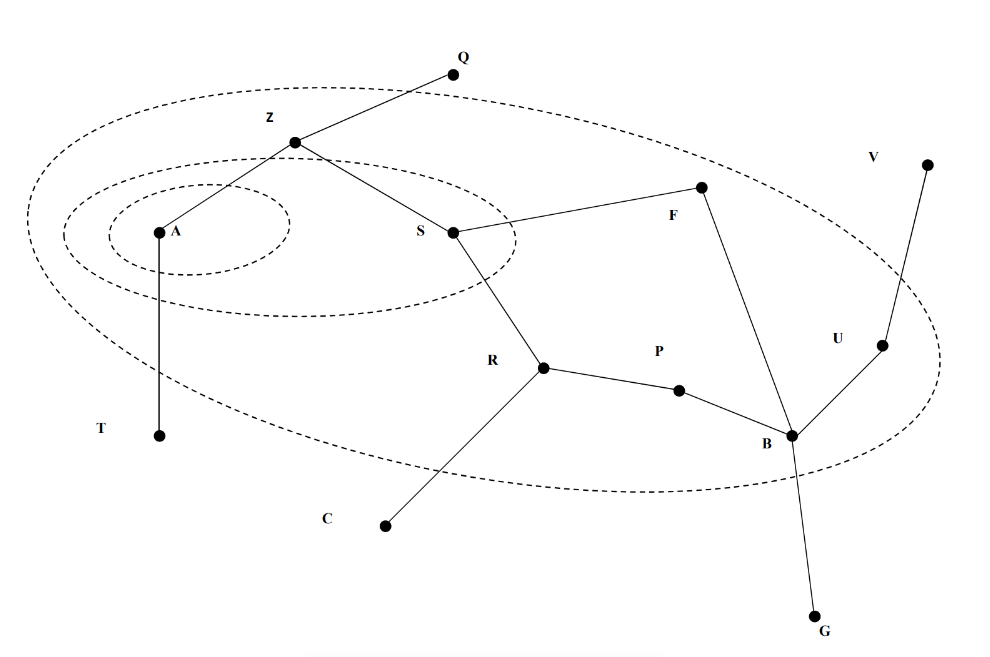

### Algoritmii euristici si Teoria Jocurilor
- Incertitudinea din teoria jocurilor, la fel ca in lumea reala, reise din incapacitatea oamenilor sa conceapa solutia optima intr-o perioada de timp adecvata
- Ca urmare, suntem nevoiti sa folosim diverse strategii euristice pentru a elimina cazurile nedorite (**retezare**), astfel incat cautarea unei mutari cat mai bune sa ia cat mai putin timp.
- In urmatoarele situatii, vom prezenta tehnica de cautare prezentata mai sus, aplicata in teoria jocurilor (vom considera jocurile de 2 persoane cu informatie completa), iar apoi ii vom optimiza prin retezare.
#### **Algoritmul minimax**
  - 2 jucatori: **MIN** (minimizeaza castigul lui MAX) si **MAX** (incearca sa maximizeze castigul, muta primul)
  - este formata dintr-o stare initiala, o multime de operatori (mutarile), un test terminal si o functie de utilitate (returneaza scorul rezultatului)
  - Fiind extrem de ineficient, se va folosi doar pentru a analiza mutarile pentru cateva nivele (pana cand timpul expira, vezi **Iterative Deepening strategy**)
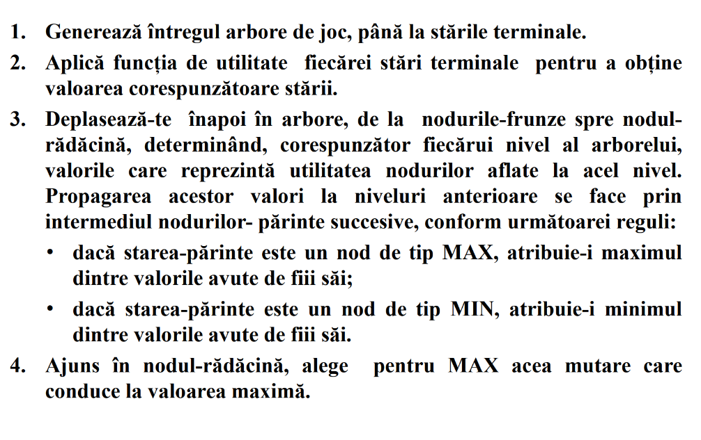
- Algoritmul poate fi optimizat prin 2 moduri:
  - in loc de **functia de utilitate** avem **functia de evaluare** ce reprezinta o estimatie a rezultatului jocului, dintr-o pozitie data
#### **Functia de evaluare**
  - aceasta estimatie se bazeaza pe **caracteristicile** unei pozitii
  - o valoare reprezinta o multime de pozitii, ce formeaza o **categorie**
  - $w_1f_1 + w_2f_2 + ... + w_nf_n$, unde $w_i$ reprezinta ponderea pozitiei $i$, iar $f_i$ caracteristicile pozitiei $i$
  - Ponderile pot fi aflate automatizat, prin executarea repetata a jocului dintre program si el insusi, iar mai apoi calibrate dupa fiecare joc
  - In cazul caracteristicilor, ele nu pot fi aflat automatizat
### Alpha Beta Prunning
- Reprezinta o optimizare a algoritmului MiniMax, intrucat integreaza tehnica de retezare
- **Tehnica de retezare** presupune gasirea unei solutii suficient de bune pentru a renunta la o parte din arborele de cautare astfel incat timpul de aflare a deciziei corecte sa fie rezonabil
- Aceasta tehnica este implementata prin existenta variabilelor $\alpha$ si $\beta$ care reprezinta valoarea minima pe care o poate lua MAX, respectiv, cea maxima. Pe parcursul programului, acestea cresc una catre cealalta 
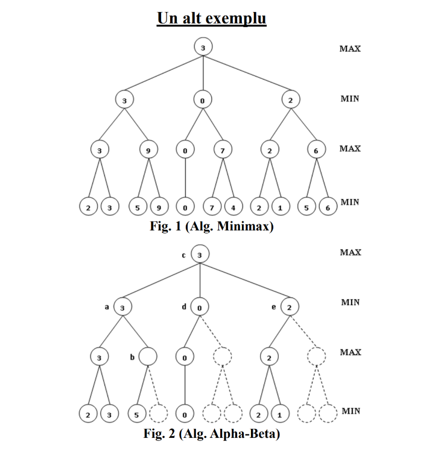

### Reprezentarea cunostintelor (refactoring)
- Cunostinte relationale (ca in bazele de date, se pot baza si pe mostenire)
- Cunostinte inferentiale (logica matematica - rezolutie)
- Cunostinte procedurale
  - Presupun specificarea unor detalii, cum ar fi **ce** anume se intampla si **cand** anume
  - Pentru reprezentarea lor, se folosesc **reguli de productie**, adica structuri de tipul if-then-else, cu diverse interpretari
- **Sistemul expert**
  - Reprezinta un program care se comporta ca un expert intr-o arie restransa, bazandu-se pe cunostintele unor persoane experte reale
  - El este compus dintr-o baza de cunostinte, un motor de inferenta si o interfata grafica.
- Principalele modalitati de reprezentare sunt:
  - **Cele bazate pe logica**: pot fi bazate pe inferenta logica sau bazate pe reguli (mecanisme de inainte de inapoi)
  - **Slot-filler**: se bazeaza pe cautari si reprezentarea lor prin grafuri si pe **pattern matching**

### Retele Bayesiene
- In lumea reala, evenimentele pot fi de 2 tipuri: dependente de alte evenimente sau independente.
- Pentru a putea lucra si modela evenimente dependente vom folosi o **retea Bayesiana**
- Pe scurt, Reteaua Bayesiana constituie un graf directionat aciclic in care fiecare muchie corespunde unei dependente conditionate si fiecare nod corespunde unei variabile aleatoare unice (descrise de un expert) care este reprezentata printr-un tabel (**Conditional probability table / CPT)** de probabilitati conditionate ale parintilor ei.
- **Suportul cauzal** al unei variabile aleatorii (nod în topologie) se referă la evidența sau informația care influențează probabilitatea unei variabile prin intermediul relațiilor cauzale directe sau indirecte reprezentate în rețea. Acesta implică un raționament de sus în jos (de la cauză la efect) sau în lanț prin legăturile cauzale.
- **Suportul probatoriu** al unei variabile aleatorii (nod în topologie) se referă la raționamentul de jos în sus (de la variabilele observate mergând din părinte în părinte spre nodul curent)
- Pe langa acestea, probabilitatile evenimentelor sunt calculate cu relatia lui Bayes, $P(A|B) = \frac{P(B|A) * P(A)}{P(B)}$, unde:
  - P(A∣B) este probabilitatea evenimentului A dat fiind că evenimentul B a avut loc (**probabilitatea a posteriori**).
  - P(B∣A) este probabilitatea evenimentului B dat fiind că evenimentul A a avut loc (**verosimilitatea**).
  - P(A) este probabilitatea a priori a evenimentului A.
  - P(B) este probabilitatea a priori a evenimentului B (probabilitatea totală).
- Dorim sa construim aceste tipuri de retele cu evenimentele pe care le avem pentru a introduce dovezi (observații despre stările anumitor variabile) și apoi actualiza probabilitățile celorlalte variabile din rețea (fie cauze, fie efecte), calculând probabilitățile a posteriori. Acest proces se numește **inferență Bayesiană** (facem deductii despre alte evenimente).
- Retelele Bayesiene sunt reprezentate ca **poliarbori**. Caracteristica definitorie a unui poliarbore este că între oricare două noduri din graf există cel mult o singură cale (neorientată). De exemplu, stiind ca a nins, dorim sa aflam probabilitatea ca este iarna, avand deja anumite probabilitati cunoscute (nodurile radacina si frunzele).
- Aceste inferente sunt realizate de **algoritmii de inferenta** care se bazeaza pe principiul **independentei conditionate** pentru a optimiza calculele si a reteza subarbori.
- **Independenta conditionata** are loc atunci cand toate drumurile care pleaca dintr-o multime de noduri $X$ sunt blocate **nedirectionat** (adica nu se ia in considerare directia) sa ajunga in $Y$ de o multime de noduri $E$. Altfel spus, două evenimente sau variabile aleatoare A și B sunt independente condiționat pe un al treilea eveniment sau variabilă aleatoare C dacă probabilitatea ca A să se întâmple (sau să ia o anumită valoare), dată fiind informația că B s-a întâmplat (sau a luat o anumită valoare), nu este influențată de faptul că C s-a întâmplat (sau a luat o anumită valoare). Formal, avem ca $P(A \cap B | C) = P(A,B∣C) = P(A∣C)\cdotP(B∣C)$
- În cadrul unei rețele Bayesiene, un drum blocat condiționat (conditionally blocked path) reprezintă o secvență de noduri conectate prin arce (într-o anumită direcție), unde transmiterea influenței probabilistice (sau a dependenței) între două noduri de la capetele drumului este oprită sau blocată de starea cunoscută (condiționată) a unuia sau mai multor noduri intermediare de pe acel drum.
- Fiind dată o mulţime de noduri E, spunem că un drum este blocat condiţionat de E dacă există un nod Z aparţinând drumului, pentru care una dintre următoarele trei condiţii se verifică:  
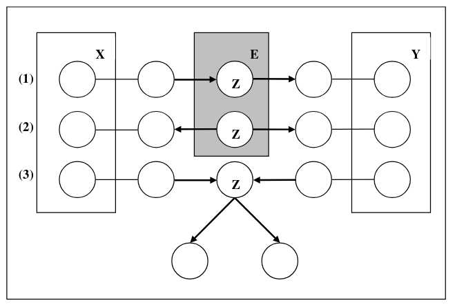
- Exemplificare (**se presupune ca nodurile din Z vor fi observate**):
  - Cazul 1 (X -> Z -> Y sau invers):  
    Daca Z **este observat**, atunci X si Y devin **independente**, altfel sunt **dependente**  
    X = Ploaie  
    Z = Trotuar ud  
    Y = Alunecare.  
    Dacă știm că trotuarul este ud, atunci dacă a plouat sau nu devine irelevant pentru probabilitatea de a aluneca (în măsura în care ploaia influențează alunecarea doar prin faptul că face trotuarul ud). X și Y devin independente condiționate pe Z.
  - Cazul 2 (X -> Z, Y -> Z):
    **Blocare**: Un drum între X și Y este blocat condiționat de E dacă un nod Z sau oricare dintre descendenții lui Z nu sunt observați (**adica nici Z și nici descendenții nu aparțin lui E**).  
    X = Lipsă de somn  
    Y = Stres  
    Z = Durere de cap.  
    Dacă nu știm dacă o persoană are dureri de cap, lipsa de somn și stresul pot fi independente în influența lor asupra altor variabile. Însă, dacă știm că persoana are dureri de cap, atunci a ști că a avut puțin somn ar putea reduce probabilitatea ca stresul să fie cauza principală, introducând o dependență (negativă) între lipsa de somn și stres, condiționată pe durerea de cap.
  - Cazul 3 (Z -> X, Z -> Y):  
    Daca Z **este observat** atunci ele sunt **independente**, altfel ele sunt **dependente**.   
    Z = Defect de fabricație  
    X = Produs defect (tip 1)  
    Y = Produs defect (tip 2).  
    Ambele tipuri de defecte sunt cauzate de același defect de fabricație. Dacă știm că a existat un defect de fabricație, atunci observarea unui produs defect de tip 1 nu ne spune nimic nou despre probabilitatea ca un alt produs să aibă defect de tip 2 (deoarece amândouă sunt deja explicate de defectul de fabricație cunoscut). X și Y devin independente condiționate pe Z.
- **D-separarea** ne spune dacă fluxul de influență probabilistică (sau dependența) între două seturi de variabile este "blocat" de cunoașterea stării unui al treilea set de variabile. Dacă toate căile posibile de influență sunt blocate, atunci cele două seturi devin independente în contextul informației date.
- 2 noduri (sau seturi de noduri) X și Y sunt **d-separate** de un set de noduri E dacă toate căile neorientate între un nod din X și un nod din Y sunt "blocate" de setul E. Două noduri X şi Y sunt independente condiţionat de E, dacă toate drumurile nedirecționate (ignorând sensul arcelor) de la X la Y sunt d-separate de E
- In practica, utilitatea retelelor Bayesiene consta in aflare probabilitatilor unor anumite evenimente conditionate de alte evenimente ale caror probabilitati au fost introduse de experti bazandu-se pe diferite date si experimente. Aceste probabilitati sunt calculate prin diferiti algoritmi de inferenta si folosindu-se anumite formule intre ele. Mai jos se poate gasi modalitatea de notatie a diferitelor componente in functie de evenimentul a carei probabilitate dorim sa o aflam (aici $X$), precum si algoritmul din spatele determinarii ei ($P(X | E), E = E^+ \cup E^-$):
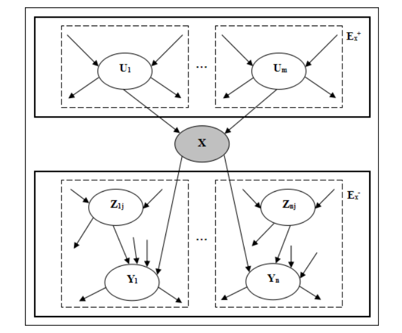
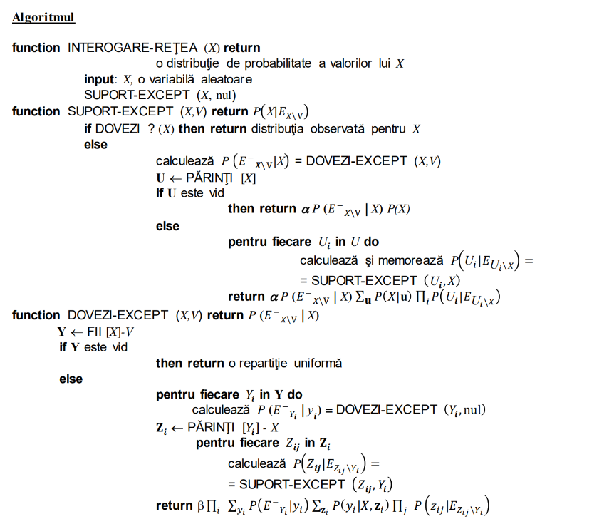

# Invatarea automata

### Notiuni generale
- Se foloseste atunci cand nu putem scrie un program pentru determinarea unei anumite functii, deoarece este prea complexa, insa avem output-ul pentru multe input-uri. Ca urmare, vom incerca sa estimam cat mai bine functia respectiva din ce corelatii de input si output avem.
- Pricipalele componente ale unui algoritm de invatare automata sunt:
  - Reprezentarea / Modelarea
  - Evaluarea
  - Optimizarea
- Paradigme de invatare:
  - Supervised learning
  - Unsupervised learning
  - Reinforcement learning
  - Semi-supervised learning
  - Active learning
  - Transfer learning
- Pentru supervised learning avem urmatoarele metode de invatare principale:
  - Clasificatorul Bayes naiv
  - Metoda celor mai apropiați vecini (k-NN)
  - Clasificatorul cu vectori suport
  - Metode kernel
  - Regresii: Liniara, Ridge, Lasso
  - Rețele neuronale și învățare "deep"
  - Arbori de decizie și random forests
- Pentru supervised learning avem urmatoarele forme canonice:
  - Regression
  - Classification
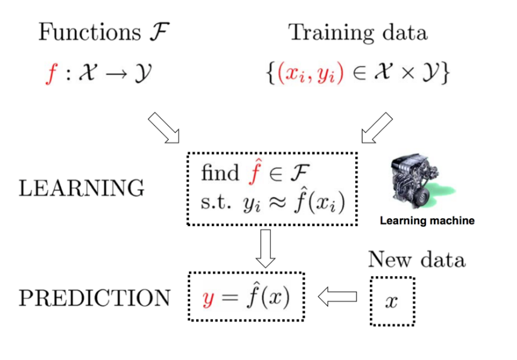
- **Unsupervised learning** works with **unlabeled** data: the algorithm tries to find hidden patterns or structures without any prior knowledge of correct outputs.
- Principalele metode de unsupervised learning sunt:
  - K-means clustering
  - **PCA**
  - Clustering ierarhic
  - Analiza în componente principale
  - Modele de tip auto-encoder
  - Anomaly detection
  - Association rule learning
- Pentru unsupervised learning avem urmatoarele forme canonice:
  - Clustering
  - Dimension reduction
- **Invatarea activa** presupune alegerea unui subset mic dintr-un set de date neetichetate pe care să îl etichetăm pentru a obține un clasificator cât mai bun.
- **Transfer learning** presupune reutilizarea unui model antrenat pe un anumit domeniu / problema pe un alt domeniu / problema

### Structura invatarii programelor
- Procesul de invatare al programelor se realizeaza in 3 etape: antrenarea, validarea si testarea. Fiecare va avea un set specific alocat din dataset-ul furnizat
- Validarea are rolul de a produce o estimare mai buna a hiperparametrilor programului. Daca am face testarea hiperparametrilor pe set-ul de test, atunci am putea ajunge la overfitting
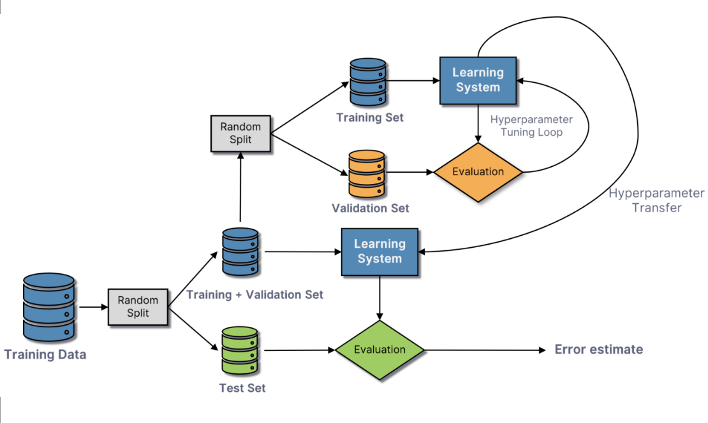
- O modalitate similara este cea de **cross-validation** care presupune divizarea setului de date de antrenament in $k$ parti, fiecare parte, prin rotatie, ajungand sa fie multimea de validare
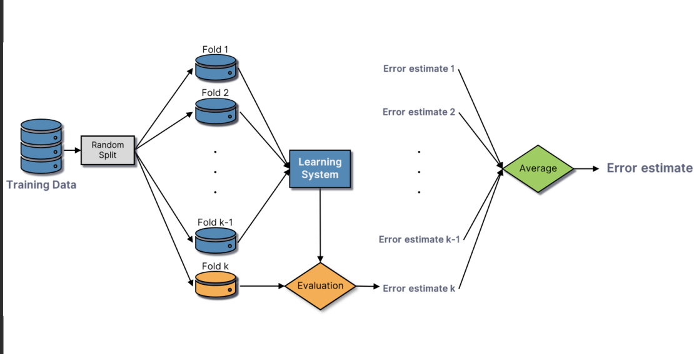

### Evaluarea performantei
- **Accuracy**: Overall correctness. Not very good usually.
- **Precision**: How many of the predicted positives are actually positive: tp / (tp + fp)
- **Recall**: How many of the actual positives were correctly predicted: tp / (tp + fn)
- **F1 Score**: Harmonic mean of precision and recall: $\frac{(1 + \beta^2)\cdot precision \cdot recall}{\beta^2 \cdot precision + recall}$
- **Confusion Matrix**: Shows TP, FP, TN, FN for deeper analysis.
- **Jaccard Index**: Overlap between predicted and actual labels.
- **ROC-AUC**: For binary classifiers — tradeoff between true and false positives.
- **MSE / MAE**: For regression. Depends on how much we want to punish the mistakes.
- **Kendall’s Tau (τ)**: Is a non-parametric measure of the strength and direction of association between two rankings.
- **Model Parameters**: These are internal to the model and are learned from the training data. In SVMs, w and b define the decision boundary that separates different classes.
- **Hyperparameters**: These are external configurations set before the training process begins. They control aspects of the training process and model complexity.

### Clasificatorii
- Clasificatorii sunt programe care, antrenandu-se pe anumite dataset-uri ce au label-uri, incearca sa invete cum sa clasifice cat mai bine datele pe label-uri astfel incat sa fie cat mai aproape de realitate.

### Clasificatorul Naive Bayes
- **Clasificatorul Bayes** realizeaza clasificarea datelor in functie de probabilitatile cu care aceastea (sau parti din ele, numite **feature-uri**) au loc in cadrul dataset-ului de antrenament (de ex, vezi exercitiul cu imagini si pixeli). Altfel spus, analizand datele, el returneaza clasa $C$ cea mai probabila stiind ca avem ca test set-ul de date $D$, adica ne da clasa $C$ pentru care $P(C | D)$ este maximizata. Acest lucru este realizat prin formula lui Bayes si utilizand asumptia **feature-urile** lui $D$ sunt conditional independente, astfel incat formula sa fie mai usor de calculat (de aceea ii zice naiv, pentru ca de cele mai multe ori in realitate nu sunt conditional independente).
- Un alt aspect important al clasificatorului Bayes reprezinta calcularea efectiva a probabilitatilor. Pentru acest lucru ar trebui sa stim cat mai bine distributia feature-urilor unui set de date. Cele mai comune distributii ale feature-urilor, impreuna cu utilizarile lor sunt urmatoarele:
  - **GaussianNB**: utilizat in cazurile in care feature-urile sunt continue; $P(x_i | Y) = \frac{1}{\sqrt{2\pi \sigma_Y^2}} \exp\left(-\frac{(x_i - \mu_Y)^2}{2\sigma_Y^2}\right)$
  - **MultinomialNB**: atunci cand lucram cu feature-uri discrete (ex.: inaltimi ale unor oameni in cm); $P(x_i | Y) = \frac{\text{count}(x_i, Y) + \alpha}{\sum_{j=1}^n \text{count}(x_j, Y) + \alpha \cdot n}$
  - **BernoulliNB**: pentru situatiile cand avem feature-urile au valori binare (ex.: daca o persoana traieste sau nu); $P(x_i | Y) = \begin{cases} p_{iY} & \text{if } x_i = 1, \\ 1 - p_{iY} & \text{if } x_i = 0, \end{cases}$
  - **CategoricalNB**: folosit la fel ca **MultinomialNB** in cazurile in care in loc de numere sunt denumiri de categorii; $P(x_i | Y) = \frac{\text{count}(x_i, Y) + \alpha}{|Y| + \alpha \cdot n}$
  - **ComplementNB**: folosit atunci cand setul de date este biased catre o clasa, el avand astfel rolul de a echilibra intr-o anumita masura probabilitatile finale (eg.: predictia unor boli foarte rare); este folosit doar daca datele de intrare sunt discrete; $w_{yi} = \log \frac{ \sum_{d \notin y} \text{count}(x_i, d) + \alpha }{ \sum_{d \notin y} \sum_{j=1}^n \text{count}(x_j, d) + \alpha \cdot n }$
- In order to prevent unseen features in dataset we use a **smoothing parameter**, usually marked as $\alpha$

### K-Nearest Neighbours (KNN)
- Acest clasificator se foloseste de feature-urile si label-urile din training dataset pentru a calcula cele mai apropiate k feature-uri de feature-ul de test, folosindu-se de o anumita distanta (de obicei l1 sau l2)
- Dintre feature-urile obtinute (cele mai apropiate) se calculeaza label-ul majoritar / cel mai frecvent care va deveni label-ul feature-ului de test
- Aceasta metoda este **dataset sensitive**, deoarece, de la un moment dat, cu cat crestem numarul dimensiunilor, cu atat cresc inacuratetea si complexitatea de timp a algoritmului. In plus, daca setul de antrenare are o distributie diferita fata de cel de testare, vom avea si aici probleme cu acuratetea

### Blestemul dimensionalitatii
- Adăugarea mai multor caracteristici păstrând dimensiunea setului de antrenare degradează performanța clasificatorului
- Atunci când distanța dintre observații crește, învățarea automată devine mult mai dificilă, deoarece scade probabilitatea de a găsi exemple de antrenare cu adevărat similare cu cele de test

### SVM
- **SVM** este un algoritm de **supervised learning**, specific pentru clasificare si regresie.
- It finds the best hyperplane that separates data into classes. The “best” hyperplane is the one with the maximum margin — the greatest distance between the hyperplane and the nearest data points (called support vectors).
- Concret, fiind dati o multime de vectori de antrenare $x_i \in \R^n$ si label-uri $y_i \in \set{-1, 1}$ pentru fiecare in parte, dorim sa gasim un hiperplan de forma $wx + b = 0$, unde $w$ este normala hiperplanului (adica perpendiculara pe hiperplan) si $b$ este bias-ul. Pentru ca datele sa fie corect clasificate mai avem nevoie si de conditia $y_i(wx_i + b) \ge 1 - \xi_i$. Daca $\xi_i = 0$ atunci avem **hard margin**, deoarece nu se permite nicio clasificare gresita, oricat de mica ar fi (de obicei duce la **overfitting**). In practica aceste erori de clasificare sunt controlate prin parametrul **C**.
- De asemenea, cum dorim sa maximizam marginea, trebuie sa minimizam valoarea $\frac{1}{2} ||w||^2$.

### Metoda Kernel
- De multe ori insa, datele furnizate nu sunt **liniar separabile** (de ex. functia XOR). In acest caz suntem nevoiti sa folosim **metoda kernel**.
- **Functia de kernel** are rolul de a calcula o valoare pe baza a 2 exemple date ca parametri, valoare ce reprezinta de fapt similaritate dintre feature-urile date ca parametri fara a se mai scufunda intr-un spatiu multidimensional. De aceea se mai numeste si **kernel trick**.
- Strategia de determinare a etichetei unui test este urmatoarea: fiindu-ne dat un sir $\alpha$ de lungime $n$ si un $b$, se determina suma functiei kernel pentru fiecare pereche de input si testul curent, apoi se normalizeaza valorile, iar in final obtinem un o valoare ce ne da informatiile pentru algerea etichetei corespunzatoare. Aceasta este si functia de decizie si are urmatoarea formula: $f(x^{\text{test}}) = \sum_{i=1}^n \alpha_i \, K_{\text{norm}}(H_i, H_{\text{test}}) + b$
- - Formal, o **functie kernel** reprezinta o functie $k : X^2 -> \R$ a.i. exista o functie $\theta : \R^m -> F$, $m$ fiind numarul de feature-uri, pentru care $k(x, y) = scalarProduct(\theta(x), \theta(y))$.
- Cele mai comune functii kernel, impreuna cu scufundarile corespunzatoare, sunt urmatoarele:
  - **Linear Kernel**: $K(x_i, x_j) = x_i^T\cdot x_j$ si $\phi(x) = x$
  - **Polynomial Kernel**: $K(x_i, x_j) = (x_i^T \cdot x_j + c)^d$ si $\phi(x)$ depinde de parametri
  - **RBF (Radial Basis Function)**: $K(x,x′)=e^{−\gamma∥x−x′∥^2}$, where $\gamma$ is a parameter that defines the influence of a single training example (the smaller the wider the similarity definition between 2 points is), and $x$ and $x'$ are the feature vectors.

### Primal and dual forms
- In problemele de optimizare, exista 2 moduri in care se poate aborda: forma primala si forma duala
- Primal Problem: Think of the primal problem as the "direct" way to solve your optimization goal. You want to achieve some objective (minimize cost, maximize profit, find the best separating hyperplane), and you have a set of constraints that must be satisfied. You are directly trying to find the values of your main decision variables (e.g., the weights and bias of a hyperplane) that achieve this objective.
- Dual Problem: The dual problem offers an "indirect" or "alternative" perspective. Instead of directly optimizing your original variables, you introduce new variables (Lagrange multipliers) associated with each constraint. These multipliers can be thought of as "prices" or "penalties" for violating the constraints. The dual problem then tries to find the best possible lower bound (for a minimization problem) or upper bound (for a maximization problem) on the optimal value of the primal problem.

### Classification types
- Algoritmii prezentati pana acum merg pe abordarea **One vs One**. Aceasta presupune realizarea separarii dintre toate perechile de 2 clase stabilite.
- Pe langa aceasta exista si metoda **One vs All** ce presupune separarea unei clase de toate celelalte in mod direct. Pentru asta se foloseste **analiza liniar discriminanta** ce presupune aproximarea unei distributii Gaussiene pentru fiecare clasa si apoi definirea unui hiperplan pe care sa se proiecteze punctele a.i. 1) distanta dintre clase sa fie maximizata si 2) dispersia unei clase sa fie minimizata

### Regresii
- In multe situatii suntem nevoiti sa determinam o functie care modeleaza (interpoleaza) cel mai bine datele pe care le avem. Pentru aceasta folosim metode de regresie (liniara, Ridge, Lasso) care presupun estimarea functiei minimizand penalizarile abaterilor de la functia obtinuta.
- Concret, dorim sa determinam o functie $y = w^Tx + b$ unde $w$ este vectorul coeficient (panta) format din $(w_1, w_2 ...)$ pe care modelul doreste sa-l calculeze, $x = (x_1, x_2, ...)$ este vectorul dat, iar $b$ este bias-ul / intercept-ul. De asemenea, vrem sa o facem in asa fel incat sa minimizam **MAE** si **MSE**
- Totusi, in regresia liniara, adica cea prezentata mai sus, in cazul in care avem zgomot sau feature-urile au valori mari, modelul nostru poate face overfitting. Pentru aceasta, au fost create regresiile **Ridge** si **Lasso**, care presupun o regularizare a datelor prin introducerea unor penalizari pentru valorile $w_i$ prea mari calculate. In regresia Ridge, the larger the $\alpha$, the more we shrink the coefficients toward 0 (but not exactly 0). Regresia Ridge presupune o penalizare bazata pe `L2`, in timp ce regresia Lasso se bazeaza pe `L1`.

### Retele neuronale. FNNs
- Retelele neuronale se bazeaza pe **perceptron**. Acesta reprezinta un clasificator liniar foarte similar cu cel de la regresii ce consta in formula $\hat{y} = w^Tx + b$, unde $w$ reprezinta vectorul de ponderi corespunzator muchiilor care intra in perceptron, iar $b$ este bias-ul, adica de la ce valori dorim ca functia sa fie interpretata intr-un anumit fel
- Obtinand input-ul din formula de mai sus, in care modelul va avea ca scop determinarea weight-urilor si bias-urilor, dorim sa-l interpretam intr-un anumit fel, iar variatiile din perceptroni sa se reflecte proportional in rezultatul final. Pentru aceasta folosim o **functie de activare**. Cele mai comune functii de activare, determinate si de ce obiectiv avem, sunt urmatoarele:
  - **Identity** (nu face nimic)
  - **Sign**: buna pentru clasificarea binara
  - **ReLU** / **Leaky ReLU**: for classification and images
  - **Tanh**: ??
  - **Sigmoid**: for probabilities
  - **Softmax**: multiple probabilities
- Avand aceste notiuni in minte, o retea neuronala este formata din mai multe straturi de perceptroni, fiecare strat avand o matrice de ponderi si bias-uri, reprezentand sursa de influenta pentru urmatorul strat.
- In retelele de tip **feedforward (FNNs)**, primul strat va reprezenta setul de feature-uri ale input-ului, straturile intermediare se mai numesc si **hidden layers**, iar stratul final, alcatuit dintr-un singur neuron reprezinta output layer-ul.

- Procesul de invatare al retelei se realizeaza pe baza unei functii de cost. Concret, avand rezultatul din output layer pentru fiecare training data, il comparam cu rezultatul din label printr-o **functie de pierdere**, iar in functie de media acestor erori aflam performanta retelei.
- Exista mai multe tipuri de **loss functions**:
  - Regression Tasks: MSE, MAE, Huber, or Log-Cosh, depending on sensitivity to outliers.
  - Binary Classification: **Binary Cross-Entropy** or Hinge Loss.
  - Multi-Class Classification: Categorical Cross-Entropy or Sparse Categorical Cross-Entropy.
  - Imbalanced Datasets: Focal Loss.
  - Metric Learning (e.g., Face Recognition): Contrastive or Triplet Loss.
  - Image Segmentation: Dice Loss or IoU Loss.
  - Classifications with probabilities distributions: **Kullback–Leibler (KL) Divergence** measures how one probability distribution diverges from a second, expected probability distribution

- Pentru a mari acuratetea retelei, dupa ce am obtinut valoarea **functiei de pierdere**, dorim sa ne apropiem cu toate componentele retelei (weight-urile si bias-urile) de valori cat mai mici. Acest lucru se realizeaza cu metoda de **gradient decent** care presupune derivarea partiala a functiei retelei neuronale in fiecare componenta a sa si folosirea lor pentru a prezice modificarea unei componente pentru a se apropia de un minim local.
- Totusi, rularea acestui algoritm pe toate input-urile este destul de costisitoare. Pentru asta vom folosi **stochastic gradient descent** care presupune alegerea la intamplare a catorva feature-uri pe care sa aflam valorile gradient-ului si apoi sa actualizam parametrii
- Aceste operatii se realizeaza in practica prin diferiti algoritmi, insa toti sunt bazati pe **gradient decent**:
  - **Backpropagation** presupune actualizarea valorilor pornind de la output layer la primul layer
  - **Algoritmul Widrow-Hoff**: presupune actualizarea valorilor (weights si bias) pe loc, in momentul determinarii unui nou rezultat pentru un perceptron la o anumita epoca. Se bazeaza pe valorile obtinute din stratul anterior si presupune ca functia de activare a perceptronului este functia identitate

### **Convolutional neural networks (CNNs)**
- Retelele convolutionale se bazeaza pe operatia de **convolutie** dintre o submatrice a input-ului (**care va fi mereu o matrice**) si o matrice numita **kernel**, care reprezeinta de fapt inmultirea element cu element a celor 2. Output-ul acestei operatii va fi o matrice de dimensiunea kernel-ului si va reprezenta un **feature map**.
- Un input poate fi format din mai multe dimensiuni, adica mai multe astfel de matrici, in care fiecare dimensiune este responsabila cu un tip de feature (de ex. imaginile RGB), caz in care se vor defini mai multe **canale**, unul pentru fiecare matrice, fiecare cu propriul kernel (sau nu), ce la final se vor uni si vor forma **output-ul layer-ului**.
- Inmultirea din operatia de convolutie se realizeaza prin sliding-ul matricii kernel de-a lungul input-ului. Pasul cu care se realizeaza acest sliding se numeste **stride**.
- For example, given an input of $n\times n$ size, the new size will be $\frac{n - k + 2 \cdot p}{stride} + 1$
- Totusi, se poate observa ca valorile aflate pe marginile matricei nu sunt luate in calcul prea des. Atunci cand ele sunt importante, insa, asta devine o problema. Pentru a o rezolva vom adauga un padding pentru input si, pe noua matrice, vom aplica identic operatia de convolutie.
- Aceste notiuni prezentate alcatuiesc **convolutional layer**-ul ce are rolul de a extrage feature-uri.
- De multe ori insa nu avem nevoie de toata imaginea, ci doar de parti din ea, in principal pentru a mari eficienta algoritmului. Pentru aceasta vom crea **pooling layer-ul** care are rolul de a reduce din dimensiunile fiecarui canal. Procesul de realizare este unul similar celui de la convolutie, doar ca nu se vor mai aduna numere, ci doar se va alege unul (de obicei cu functia de **MAX** sau **AVG**).
- Dupa ce am terminat de procesat canalele input-ului dorim sa le unim. Pentru asta vom aplica **flattening layers** ce au rolul de a transforma matricile in vector 1D pentru ca **Dense layer**-ele sa poata lucra cu datele obtinute
- **Dense layer**-ele au rolul de a analiza datele primite pentru detectarea de feature-uri si integrarea lor in predictii
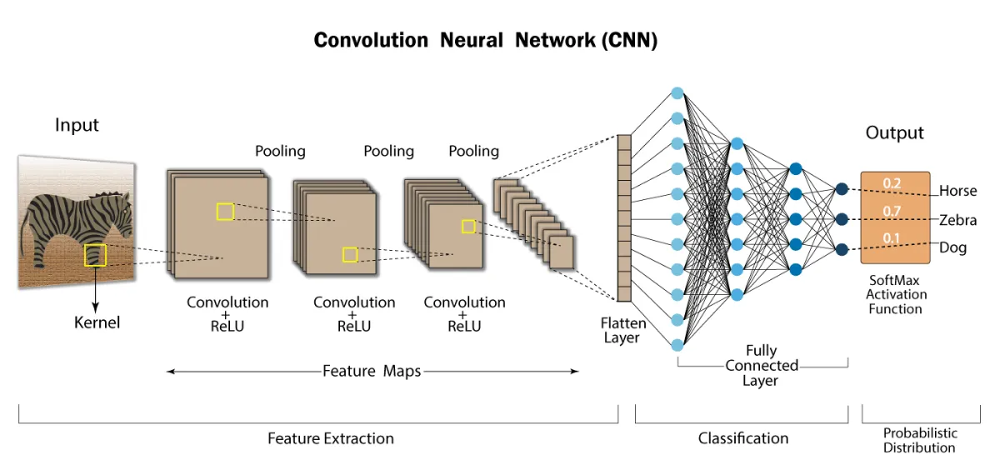
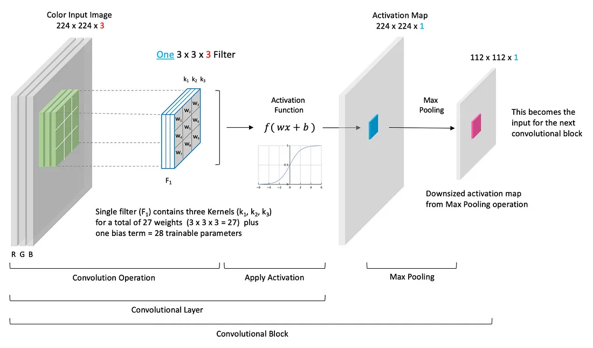
- In ceea ce priveste functia de activare, ea este prezenta doar la **convolutional layers** si **dense layers**
- **Hiperparametrii**: stride (S), kernel size (K), padding (P)

### Other types of neural networks
- **Long short-term memory networks**: for voice recognition
- **Recurrent Neural Networks (RNNs)**