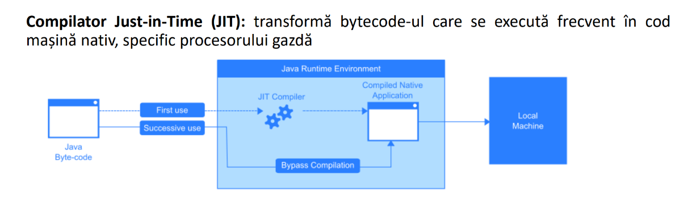
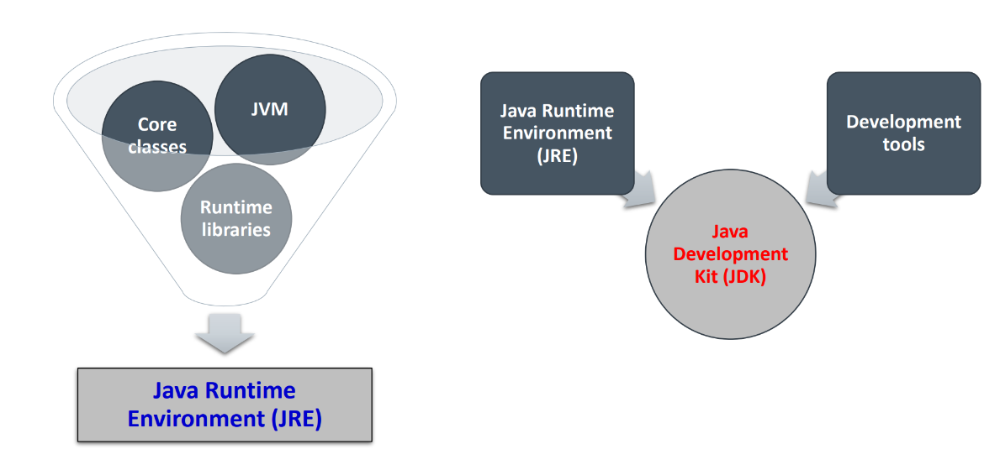

## General information
- The compiled languages are converted into binary before execution, making them fast but platform dependent
- The interpreted languages are converted into a special binary format and then, at the execution phase, are tranformed into binary such that they can be processed, making it slower, but platform independent, only technology dependent
- Java, as most modern programming languages nowadays, are both interpreted and compiled

- **Boxing** refers to the process of converting a primitive to the corresponding **wrapper class**, such that we can work with that primitives in an object-like fashion (Java works mainly with objects + wrapper classes possess useful methods); **unboxing** is the opposite
- Pachet = colecţie de clase şi interfeţe salvate în același director