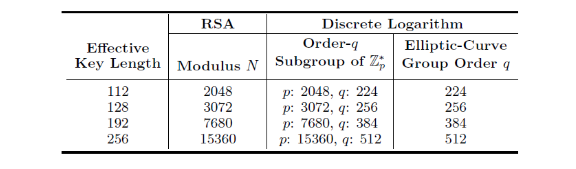
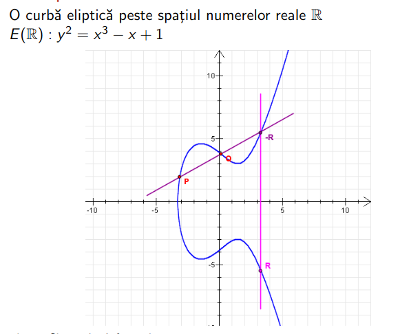
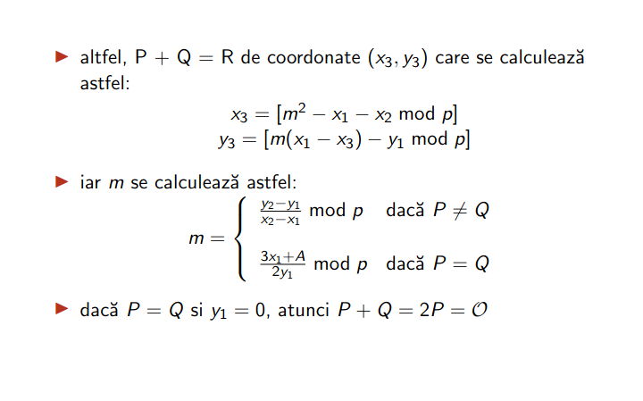
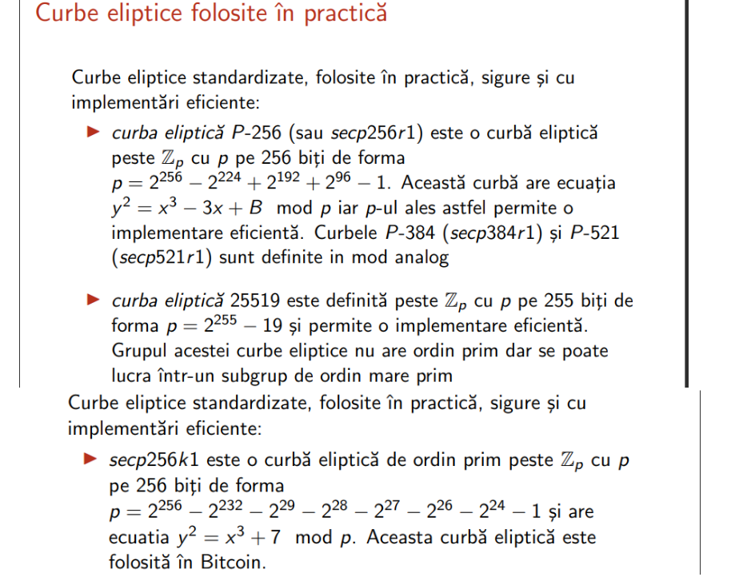
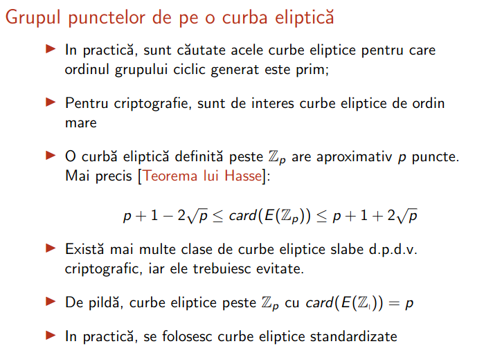
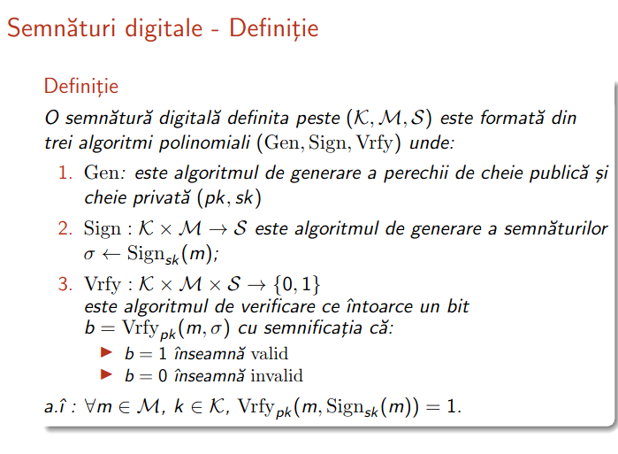
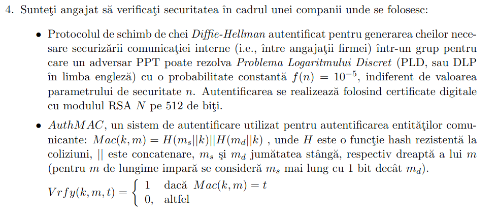

# Cybersecurity & Cryptography Cheatsheet

## Symmetric Cryptography

Perfect security (like the One-Time Pad) is theoretically unbreakable, but it is entirely impractical because the key must be as long as the message and can never be reused. Modern symmetric cryptography bridges the gap between theory and practice by moving from *perfect security* to **computational security**. 

Here is the linear evolution of how practical symmetric cryptography is designed and evaluated.

### The Foundation: Computational Security and PRGs

Instead of demanding an unbreakable system against an attacker with infinite computing power, we relax our requirements:
1. **The Attacker is bounded:** We only worry about attackers running in Probabilistic Polynomial Time (PPT) (i.e., realistic computing limits).
2. **The Success is negligible:** We accept a tiny, negligible probability of the attacker breaking the scheme (e.g., $1 / 2^{128}$).

To build a practical One-Time Pad, we need a short, secret key to generate a massive stream of seemingly random bits. This is done using a **Pseudo-Random Generator (PRG)**.

* **Formal Definition of a PRG:** A deterministic algorithm $G$ is a PRG if it takes a short, random seed $s \in \{0,1\}^n$ and stretches it into a longer string $G(s) \in \{0,1\}^{l(n)}$ where $l(n) > n$. 
* **Security Condition:** To any PPT adversary $\mathcal{A}$, the output $G(s)$ must be **indistinguishable** from a truly random string $r$ of the same length.
  $$| Pr[\mathcal{A}(G(s)) = 1] - Pr[\mathcal{A}(r) = 1] | \le negl(n)$$

### Stream Ciphers: The Practical One-Time Pad

A **Stream Cipher** is a practical implementation of the One-Time Pad using a PRG. Instead of a purely random key, Alice and Bob share a short secret key $k$, and use it to seed a PRG.

* **Encryption:** $c = G(k) \oplus m$
* **Decryption:** $m = G(k) \oplus c$

Stream ciphers are the practical, real-world implementation of the perfectly secure One-Time Pad. While a One-Time Pad requires a truly random key as long as the message, a stream cipher takes a short, secret key and expands it using a **Pseudo-Random Generator (PRG)** into a long, continuous "keystream". 

This keystream is then XORed ($\oplus$) bit-by-bit with the plaintext message.

### Operating Modes: Synchronous vs. Asynchronous

When implementing a stream cipher, managing the keystream is critical. How the system handles synchronization between the sender and receiver dictates its operating mode.

### Synchronous Mode
In synchronous mode, the keystream is generated entirely independently of the plaintext and ciphertext. 
* **The Process:** Both Alice and Bob feed their shared secret key $k$ into the PRG to start generating identical keystreams: $S_i = G(k)_i$.
* **Encryption:** $c_i = m_i \oplus S_i$
* **Decryption:** $m_i = c_i \oplus S_i$
* **The Vulnerability:** Perfect synchronization is required. If a single bit is dropped or inserted during transmission over the network, all subsequent bits will be decrypted with the wrong keystream bit, resulting in total garbage. Furthermore, if you encrypt two different messages without changing the key, you suffer a catastrophic keystream reuse failure ($c_1 \oplus c_2 = m_1 \oplus m_2$).

### Asynchronous Mode (Using an IV)
To solve the key reuse and synchronization problems, modern stream ciphers are often asynchronous. They introduce an **Initialization Vector (IV)**.
* **The Concept:** The keystream now depends on both the secret key and a publicly visible, randomly chosen IV. 
* **Encryption:** For every new message, the sender chooses a uniformly random $IV$. The keystream is generated as $G(k, IV)$. The ciphertext is $\langle IV, m \oplus G(k, IV) 
angle$.
* **The Security Guarantee:** The PRG must ensure that even if the $IV$ is public, the internal key $k$ remains secure. Crucially, if $IV_1$ and $IV_2$ are random, the outputs $G(k, IV_1)$ and $G(k, IV_2)$ must be mathematically indistinguishable. This completely solves the key-reuse problem because every single message gets a unique, fresh keystream.

### Linear-Feedback Shift Registers (LFSR)

**LFSRs** are the historic building blocks of stream ciphers. They are highly favored in hardware environments because they are incredibly fast and require very few logic gates.

### How they work:
An LFSR consists of $n$ registers (memory slots holding 1 bit each, $s_{n-1}, \dots, s_0$) and $n$ feedback coefficients ($c_{n-1}, \dots, c_0$).
At every tick of the system clock:
1. The bit at the very end ($s_0$) is output as the keystream bit.
2. The remaining bits shift one position to the right.
3. A new bit is pushed into the leftmost slot. This new bit is calculated using a linear formula:
   $$s_{new} = (c_0 \cdot s_0) \oplus (c_1 \cdot s_1) \oplus \dots \oplus (c_{n-1} \cdot s_{n-1})$$

### The Vulnerability: Linearity
While LFSRs produce sequences with excellent statistical randomness properties, they are **cryptographically insecure on their own**. 
Because the feedback mechanism uses purely linear operations (XOR), an attacker only needs to observe a small chunk of the keystream (specifically, $2n$ bits). By setting up a system of linear equations, the attacker can quickly solve for the feedback coefficients and perfectly predict all future keystream bits.

*Note: To fix this, modern systems combine multiple LFSRs using non-linear functions to destroy the predictability while keeping the hardware efficiency.*

### RC4: The Fallen Standard

RC4 was designed by Ron Rivest in 1987. For over a decade, it was the most widely used software stream cipher in the world, powering early secure web traffic (SSL/TLS) and wireless networks (WEP).

### How it works:
Unlike LFSRs, RC4 uses an array of 256 bytes (a permutation of the numbers 0-255). It uses a Key-Scheduling Algorithm (KSA) to scramble this array based on the secret key. Then, a Pseudo-Random Generation Algorithm (PRGA) continuously swaps bytes in the array to output the keystream.

### The Vulnerability: Statistical Bias
RC4 does not produce perfectly random bytes. Early bytes of the keystream are heavily correlated with the secret key.
* **The WEP Break:** In 2001, researchers (Tews, Weinmann, Pychkine, based on Klein's ideas) proved that the 104-bit key used in 128-bit WEP could be completely extracted in about 1 minute by analyzing the IVs and the statistical biases.
* **The TLS Break:** In 2013, researchers at Royal Holloway proved that if an attacker observes a message encrypted repeatedly (about $2^{28}$ to $2^{32}$ independent encryptions), they can reliably reconstruct the first ~200 bytes of the plaintext. 
* **Status:** RC4 is totally broken and officially deprecated.

### Trivium: The Modern Hardware Approach

As part of the eSTREAM project to find modern, secure stream ciphers, **Trivium** was proposed in 2008. It was specifically designed to be extremely compact and fast in hardware (like RFID tags or smart cards) while resisting the attacks that broke LFSRs.

### How it works:
Instead of standard linear registers, Trivium uses three **Non-Linear Feedback Shift Registers (NLFSRs)** of varying lengths: 93, 84, and 111 bits (totaling a 288-bit internal state).
* The registers are circularly coupled: the output of the first register feeds into the second, the second into the third, and the third back into the first.
* Crucially, at every step, a bitwise AND operation (which is mathematically non-linear) is applied to specific bits inside the registers before feeding the data forward.

### The Security Guarantee:
The introduction of the non-linear AND operation mathematically blocks the linear equation attacks that destroyed LFSRs. It is elegantly simple to implement in silicon (requiring very few logic gates) and is currently considered a highly secure standard for hardware-based stream encryption.

### Deep Dive into Block Ciphers: PRFs, PRPs, and Modes of Operation

While stream ciphers encrypt data bit-by-bit, **Block Ciphers** encrypt data in fixed-size chunks (e.g., 64-bit or 128-bit blocks). They are the workhorses of modern cryptography. To understand how they work, how they are standardized, and how we use them to encrypt long messages, we must first look at their mathematical foundations.

### The Mathematical Core: PRFs and PRPs

To build a secure block cipher, we rely on two idealized mathematical constructs:

### Pseudo-Random Function (PRF)
A PRF is a keyed function $F_k : \{0,1\}^n \to \{0,1\}^n$.
* **Intuition:** Imagine a massive lookup table filled with random numbers. When you input a value $x$, you get a seemingly random output. If you input $x$ again, you get the exact same output. A PRF acts exactly like this random lookup table, but instead of storing infinite data, it calculates the output mathematically using the secret key $k$.
* **Security:** To an attacker without the key $k$, the output of $F_k(x)$ is computationally indistinguishable from a truly random function.

### Pseudo-Random Permutation (PRP)
A PRP is a specific type of PRF with one additional, critical property: it is a **bijection** (a one-to-one mapping). 
* **Intuition:** Because no two inputs produce the same output, the function is **invertible**. If you know the key $k$, you can take the output and run the function in reverse to find the original input. 
* **The Connection:** A Block Cipher is essentially a practical implementation of a strong PRP. Encryption is running the PRP forward: $C = E_k(M)$. Decryption is running the PRP backward: $M = D_k(C)$.

### Standardizing the Blocks: DES and AES

Over the years, the cryptographic community has standardized specific block ciphers to be used globally.

### Data Encryption Standard (DES)
Adopted by NIST in 1976, DES was based on IBM's "Lucifer" cipher.
* **Specs:** It uses a 64-bit block size and a **56-bit key**. It is built on a 16-round **Feistel Network**.
* **Strengths:** DES was brilliantly designed. It is highly resistant to advanced mathematical attacks like Differential and Linear Cryptanalysis.
* **The Fatal Flaw:** The 56-bit key is simply too short. With $2^{56}$ possible keys, modern computers can brute-force DES in a matter of hours.
* **Variants:** **DES-X** added pre- and post-key XORing ($DESX_{k, k_1, k_2} = k_2 \oplus DES_k(x \oplus k_1)$) to slow down brute force. **3DES** ran the cipher three times but was computationally slow.
* To increase security, why not encrypt twice with two different keys? $c = E_{k2}(E_{k1}(m))$.
* **Meet-in-the-Middle Attack:** 2DES offers almost no extra security. An attacker computes the encryption of $m$ forward ($E_{k1}(m)$) and the decryption of $c$ backward ($D_{k2}(c)$), storing them in a table. When the two sides match, the attacker has found both keys.
* **3DES:** The standard fix was Triple-DES using 3 keys: $c = E_{k3}(D_{k2}(E_{k1}(m)))$. This provides 112 bits of security but is incredibly slow. Today, AES (Advanced Encryption Standard) has fully replaced DES.

### Advanced Encryption Standard (AES)
To replace DES, NIST hosted a public competition, selecting the **Rijndael** algorithm in 2001.
* **Specs:** AES features a **128-bit block size** and supports keys of **128, 192, or 256 bits**.
* **Architecture:** Unlike DES, AES is a Substitution-Permutation Network (SPN). It does not use a Feistel structure, meaning its mathematical rounds operate on the entire 128-bit block at once using substitutions (S-boxes), row shifting, and column mixing. It is incredibly fast in software and hardware and remains the global gold standard today.

### Modes of Operation: Encrypting Beyond One Block

A block cipher only encrypts exactly 128 bits. What if your message is a 5-megabyte file? We must break the file into blocks ($P_1, P_2, P_3, \dots$) and process them using a **Mode of Operation**.

**The Feistel Network**
The Feistel network is an elegant architectural trick to ensure invertibility, even if the underlying scrambling functions ($f$) are non-invertible.
The $n$-bit input block is split into two halves: Left ($L_0$) and Right ($R_0$). In each "round" $i$:
* $L_i = R_{i-1}$
* $R_i = L_{i-1} \oplus f_i(R_{i-1})$

*Intuition:* To decrypt, you just run the rounds backward. Because you only XORed the output of $f_i(R_{i-1})$ with the left half, and you still have $R_{i-1}$ intact on the right side, you can simply re-compute $f_i(R_{i-1})$ and XOR it again to reverse the process!

### Beyond Feistel: Substitution-Permutation Networks (SPNs) and S-Boxes

While the Feistel Network (used in DES) dominated the early days of block ciphers, modern cryptography—most notably the Advanced Encryption Standard (AES)—relies on a different architecture: the **Substitution-Permutation Network (SPN)**. 

To understand where SPNs fit into the symmetric encryption landscape, we must go back to the foundational principles of cryptography laid out by Claude Shannon in 1945.

### The Core Philosophy: Confusion and Diffusion

Shannon mathematically defined that any secure cipher must employ two distinct mechanisms to thwart cryptanalysis:

1.  **Confusion:** The relationship between the secret key and the ciphertext must be as complex and obscure as possible. An attacker looking at the ciphertext should have no mathematical clue what the key looks like. 
    * *Implementation:* We achieve confusion using **Substitution** (replacing data with other data).
2.  **Diffusion:** The statistical structure of the plaintext must be dissipated into long-range statistics of the ciphertext. If you change exactly *one bit* of the plaintext, approximately 50% of the ciphertext bits should flip (the Avalanche Effect).
    * *Implementation:* We achieve diffusion using **Permutation** (shuffling and mixing data).

### The S-Box (Substitution Box): The Heart of Non-Linearity

If a cryptographic algorithm is purely linear (built only of XORs and bit shifts), an attacker can easily break it using basic linear algebra, regardless of how many rounds the cipher has.

**The S-box is the only non-linear component in modern block ciphers.** It is the absolute mathematical core that prevents the cipher from being solved like a system of equations.

### What is an S-Box?
Formally, an S-box is a mathematical mapping function $S : \{0,1\}^n \to \{0,1\}^m$. It takes an $n$-bit input and maps it to an $m$-bit output. 
* In **DES**, the S-boxes map 6 bits to 4 bits ($6 \times 4$ S-boxes). Because the output is smaller than the input, they are not invertible on their own (which is why DES relies on the Feistel structure to decrypt).
* In **AES (SPN)**, the S-box is a bijection (one-to-one mapping) taking 8 bits to 8 bits ($8 \times 8$ S-box). Because it is bijective, it is perfectly **invertible**.

### The Math Behind the AES S-Box
Instead of being a random lookup table, the AES S-box is carefully constructed using finite field mathematics to resist specific attacks (like Differential and Linear Cryptanalysis):
1.  **Inverse:** Take the 8-bit input $x$ and find its multiplicative inverse $x^{-1}$ in the Galois Field $GF(2^8)$. (If $x = 0$, the inverse is mapped to $0$). *This step provides massive non-linearity.*
2.  **Affine Transformation:** Multiply the result by a specific matrix and XOR it with a constant vector. *This step destroys algebraic relationships, ensuring attackers can't exploit the pure algebraic structure of Galois Fields.*

### The P-Box (Permutation Box): Spreading the Chaos

If we only used S-boxes, an attacker could divide the ciphertext into small 8-bit chunks and break them one by one. We need the output of one S-box to affect the inputs of many different S-boxes in the next round.

A P-Box is a linear mixing layer that takes the substituted bits and scrambles them across the entire block.
* **Formal definition:** A linear transformation $P : \{0,1\}^B \to \{0,1\}^B$ (where $B$ is the block size, e.g., 128 bits). 
* In AES, this is achieved through two steps: **ShiftRows** (shifting bytes across rows of the state matrix) and **MixColumns** (multiplying columns of the matrix by a fixed polynomial to mathematically mix 4 bytes together).

### The Architecture of an SPN (Substitution-Permutation Network)

An SPN builds a block cipher by layering Confusion and Diffusion iteratively in a "round" structure. 

Let the plaintext block be $x$ and the subkeys for each round be $k_1, k_2, \dots, k_r$. A single round $i$ in an SPN operates on the entire block at once:

1.  **Key Mixing:** $u = x \oplus k_i$
2.  **Substitution (S-boxes):** $v = S(u)$
3.  **Permutation (Linear Mixing):** $w = P(v)$

The output $w$ becomes the input $x$ for the next round.

**Mathematical Formula for an SPN Round:**
$$Round_i(x) = P\big(S(x \oplus k_i)\big)$$

To decrypt, you simply run the network backward using the inverse functions and the keys in reverse order:
$$Round_i^{-1}(y) = S^{-1}\big(P^{-1}(y)\big) \oplus k_i$$

### Summary: SPN vs. Feistel (AES vs. DES)

Why did the cryptographic community move from Feistel Networks to SPNs?

| Feature | Feistel Network (DES) | SPN (AES) |
| :--- | :--- | :--- |
| **Data processed per round** | Only **half** the block (Left side). | The **entire** block (128 bits) at once. |
| **Diffusion Speed** | Slower (requires more rounds, e.g., 16). | Extremely fast (AES needs only 10-14 rounds). |
| **Invertibility Constraint** | The $f$-function (and its S-boxes) **do not** need to be invertible. The architecture handles decryption. | Every component (S-boxes, P-boxes) **must** be strictly invertible (bijections) for decryption to work. |
| **Parallelism** | Sequential by nature. | High parallelism. Substitution and mixing can be optimized heavily in hardware. |

**The Landscape Conclusion:** SPNs represent the modern pinnacle of symmetric block cipher design. By enforcing strict mathematical bijections in the S-boxes (for robust non-linearity) and processing the entire block simultaneously (for rapid diffusion), SPNs like AES deliver unmatched security and speed across the global internet today.

### Electronic Codebook (ECB) - The Naïve Approach
* **How it works:** Each plaintext block is encrypted independently using the same key.
  $$C_i = E_k(P_i)$$
* **The Flaw:** ECB is **deterministic**. If $P_1$ and $P_2$ are the same, $C_1$ and $C_2$ will be identical. If you encrypt a bitmap image of the Linux Penguin using ECB, the resulting ciphertext will still clearly show the outline of the penguin! **ECB is never CPA-secure** and should almost never be used.

### Cipher Block Chaining (CBC) - The Standard
To achieve CPA security, we must randomize the encryption.
* **How it works:** We choose a random Initialization Vector (IV). Before encrypting a block, we XOR it with the *previous* ciphertext block.
  $$C_0 = IV$$
  $$C_i = E_k(P_i \oplus C_{i-1})$$
* **Strengths:** Even if $P_1$ and $P_2$ are identical, the XOR step ensures their ciphertexts look completely different. It is CPA-secure.
* **Weaknesses:** Encryption is strictly sequential; you cannot encrypt block 3 until block 2 is finished, making it difficult to parallelize.

### Output Feedback (OFB) - Turning a Block Cipher into a Stream
* **How it works:** Instead of encrypting the message, we encrypt an IV repeatedly to generate a pseudo-random keystream ($S_i$), and then XOR that stream with the plaintext.
  $$S_0 = IV$$
  $$S_i = E_k(S_{i-1})$$
  $$C_i = P_i \oplus S_i$$
* **Intuition:** This effectively turns AES into a synchronous stream cipher. Errors in transmission do not propagate to the next block.

### Counter Mode (CTR) - The Modern Choice
* **How it works:** We take a random IV (or Nonce) and append a simple counter ($1, 2, 3\dots$) to it. We encrypt this Counter block, and XOR the result with the plaintext.
  $$S_i = E_k(IV \ || \ i)$$
  $$C_i = P_i \oplus S_i$$
* **Strengths:** CTR mode is incredibly powerful. Because the counter values are known in advance, you can compute the keystream $S_i$ for all blocks simultaneously. It is highly parallelizable, transforming AES into a blazing-fast, CPA-secure stream cipher.

### Wrap-Up: The Path Forward to CCA Security

By using AES in **CBC** or **CTR** mode, we achieve **CPA Security** (Chosen-Plaintext Attack). The ciphertexts are randomized and indistinguishable from noise.

However, neither CBC nor CTR is **CCA-Secure** (Chosen-Ciphertext Attack). 
Because OFB and CTR operate by simply XORing a keystream with the plaintext, they are highly **malleable**. If an active attacker intercepts a CTR-mode ciphertext and flips the 5th bit, the 5th bit of the decrypted plaintext will flip as well! An attacker can subtly alter messages without triggering any mathematical errors.

**The Ultimate Fix:** To stop active attackers from tampering with ciphertexts in transit, encryption alone is not enough. We must pair it with a **Message Authentication Code (MAC)**. Modern cryptography solves this by using **Authenticated Encryption (AE)** modes—such as **AES-GCM** (Galois/Counter Mode)—which simultaneously encrypt the data (using CTR mode) and generate a cryptographic checksum (MAC) to guarantee both confidentiality and absolute integrity.

### Formal Attack Models: CPA and CCA

As cryptography evolved, we realized attackers don't just passively intercept ciphertexts. We must define formal "games" or experiments to prove security against active attackers.

### Chosen-Plaintext Attack (CPA)
**The Setup:** The attacker is given access to an "Encryption Oracle". They can submit any plaintext $m$ and immediately get back the ciphertext $c = E_k(m)$.
**The Game ($Priv^{cpa}$):**
1. The attacker submits two messages of equal length, $m_0$ and $m_1$.
2. The challenger flips a coin $b \in \{0, 1\}$ and encrypts $m_b$, returning the ciphertext $c$.
3. The attacker must guess which message was encrypted (output $b'$).
If the attacker guesses correctly with a probability significantly greater than 50% ($1/2 + \epsilon$), the cipher is broken.

*Crucial Rule:* **No deterministic encryption scheme can be CPA-secure.** If an attacker encrypts $m_0$ using their oracle, and compares that exact ciphertext to the challenge ciphertext $c$, they will win the game 100% of the time. Block ciphers must be randomized (using Modes of Operation like CBC or CTR with an IV) to be CPA-secure.

### Chosen-Ciphertext Attack (CCA)
**The Setup:** The attacker is even more powerful. Not only do they have an Encryption Oracle, they also have a **Decryption Oracle**. They can submit any ciphertext $c$ and get back the plaintext $m$. 
**The Exception:** During the guessing game, they are not allowed to submit the exact challenge ciphertext $c$ to the decryption oracle (that would be cheating). They can, however, submit $c'$, a slightly modified version of $c$.

*Why Stream Ciphers fail CCA:* Stream ciphers (and CTR mode) are **malleable**. If an attacker flips a bit in the ciphertext, the exact corresponding bit flips in the decrypted plaintext. An attacker can take the challenge ciphertext $c$, flip the first bit to create $c'$, send $c'$ to the decryption oracle, and look at the resulting plaintext to instantly know if the original message was $m_0$ or $m_1$. 

To achieve CCA security, we must guarantee that an attacker cannot meaningfully alter a ciphertext. This requires adding **Message Authentication Codes (MACs)** to block ciphers, leading to Authenticated Encryption.

### Message Authentication Codes (MACs) and Authenticated Encryption

While encryption guarantees that a message remains secret, it does not guarantee that the message hasn't been maliciously altered in transit. This document explains the intuitive concepts and formal definitions behind achieving data integrity using Message Authentication Codes (MACs) and how we combine them with encryption to achieve full secure communication.

### Why Encryption is NOT Authentication

**The Intuition:**
Imagine a supermarket sending an email order for "10,000 bottles of water" [cite: 1767]. This message isn't secret, but it is critical that an attacker cannot intercept it and change the order to "99,000 bottles" [cite: 1788]. 

A common, dangerous misconception is that encrypting a message automatically prevents tampering [cite: 1823]. **This is completely false.** If we use a stream cipher (or block ciphers in CTR/OFB modes), the ciphertext is simply XORed with a keystream. If an attacker flips a specific bit in the ciphertext, the exact same bit will flip in the decrypted plaintext [cite: 1860, 1861, 1938]. They don't need to know the secret key or read the message to maliciously alter a financial transaction or a command [cite: 1870, 1871].

To solve this, we need a cryptographic "wax seal"—a mechanism to guarantee message integrity and authenticity.

### Message Authentication Codes (MAC): Formal Definition

**The Intuition:**
Alice and Bob share a secret key $k$ [cite: 2026]. When Alice wants to send a message $m$, she runs it through a mathematical algorithm with the key $k$ to generate a small block of data called a **tag** (or $t$) [cite: 2027]. She sends both $(m, t)$. Bob receives it, runs the same algorithm on $m$ with his copy of key $k$, and checks if his computed tag matches $t$ [cite: 2038]. 

**The Formal Definition:**
A MAC is defined by a triplet of polynomial-time algorithms $(Gen, Mac, Vrfy)$ [cite: 2051, 2052]:
1.  **Key Generation ($Gen$):** Generates a uniform secret key $k \in \mathcal{K}$ [cite: 2053].
2.  **Tag Generation ($Mac$):** Takes the key $k$ and message $m \in \mathcal{M}$, returning a tag $t$: 
    $$t \leftarrow Mac_k(m)$$
3.  **Verification ($Vrfy$):** Takes the key $k$, message $m$, and tag $t$, returning a boolean bit $b$:
    $$b = Vrfy_k(m, t)$$
    * $b = 1$ means the tag is valid [cite: 2058].
    * $b = 0$ means the tag is invalid [cite: 2059].
*Correctness requirement:* For any valid key and message, $Vrfy_k(m, Mac_k(m))$ must always output $1$ [cite: 2060].

### MAC Security (Unforgeability)

**The Intuition:**
A MAC is secure if an attacker, even after seeing millions of valid message-tag pairs, cannot independently compute a valid tag for a *brand new* message [cite: 2094]. 

**The Formal Experiment ($Mac_{\mathcal{A},\pi}^{forge}(n)$):**
We give the active attacker $\mathcal{A}$ access to a "MAC Oracle". 
1. The attacker can submit any messages $m_1, m_2, \dots, m_q$ to the oracle and get back perfectly valid tags $t_1, t_2, \dots, t_q$ [cite: 2135, 2238].
2. The attacker "wins" the game if they can output a pair $(m, t)$ such that:
   * $Vrfy_k(m, t) = 1$ (The tag is valid) [cite: 2248]
   * $m 
otin \{m_1, \dots, m_q\}$ (The message was never previously submitted to the oracle) [cite: 2248].

If the probability of the attacker winning this game is negligibly small ($Pr \le negl(n)$), the MAC is formally considered secure [cite: 2257, 2258].

*Important Limitation (Replay Attacks):* MACs absolutely **do not** protect against replay attacks [cite: 2284]. An attacker can intercept a valid bank transfer $(m, t)$ and simply re-send the exact same pair to the bank 10 times [cite: 2311, 2319]. Because the MAC algorithm is stateless, the bank will mathematically verify it as valid every time. Preventing this requires application-level logic like sequence numbers or timestamps [cite: 2331].

### Building Practical MACs: CBC-MAC

**From Fixed to Variable Length:**
We can easily build a secure fixed-length MAC using a Pseudo-Random Function (PRF) like AES: just define $t = F_k(m)$ [cite: 2357, 2358]. 

However, messages are rarely exactly 128 bits. We must handle variable lengths.
* *Failed Attempt 1:* Splitting the message into blocks and XORing them ($t = Mac_k(m_1 \oplus m_2 \dots)$) is highly insecure because an attacker can alter the blocks in ways that cancel out in the XOR operation [cite: 2414, 2427, 2428].
* *Failed Attempt 2:* MACing each block separately ($t = t_1 || t_2 || t_3$) is totally insecure because an attacker can simply rearrange the blocks or drop the last block to form a valid tag for a completely different message [cite: 2457, 2517].

**The Standard Solution: CBC-MAC**
To securely process a long message, we chain the blocks together using the Cipher Block Chaining (CBC) architecture. 
Instead of encrypting, we XOR each plaintext block with the output of the previous block's PRF calculation [cite: 2629]. We only keep the final 128-bit output block as the official tag $t$ [cite: 2659]. If any bit in the message changes, the error cascades completely, producing a wildly different final tag.

### Authenticated Encryption: Combining Confidentiality and Integrity

In practice, we almost always need both privacy and integrity (Authenticated Encryption) [cite: 2666]. There are three ways to combine a Cipher and a MAC, but only one is generically foolproof.

**CRITICAL RULE:** You must ALWAYS use two completely independent keys—one for the cipher ($k_1$) and one for the MAC ($k_2$) [cite: 2712].

1.  **Encrypt-and-Authenticate:**
    $c \leftarrow Enc_{k1}(m)$ and $t \leftarrow Mac_{k2}(m)$ [cite: 2677]
    * *Flaw:* You send $(c, t)$. Since the MAC is calculated on the plaintext, the tag $t$ itself might leak information about the plaintext $m$, breaking CPA-security [cite: 2679, 2680].
2.  **Authenticate-then-Encrypt (MAC-then-Encrypt):**
    $t \leftarrow Mac_{k2}(m)$ and $c \leftarrow Enc_{k1}(m || t)$ [cite: 2694]
    * *Flaw:* While historically used (e.g., in early TLS), it is vulnerable to complex padding oracle attacks because the receiver has to decrypt first before knowing if the message is malicious.
3.  **Encrypt-then-Authenticate (Encrypt-then-MAC) - THE GOLD STANDARD:**
    $c \leftarrow Enc_{k1}(m)$ and $t \leftarrow Mac_{k2}(c)$ [cite: 2703]
    * *Why it's secure:* You encrypt the message, and then you calculate the MAC directly on the ciphertext [cite: 2703]. The receiver verifies the tag *before* attempting to decrypt. If an attacker tampers with the ciphertext, the verification fails instantly, and the corrupted ciphertext never touches the delicate decryption engine. **This combination is always secure** [cite: 2704].

### Real-World Application: GCM (Galois/Counter Mode)
Modern systems like TLS do not manually staple a block cipher and a MAC together. They use highly optimized "Authenticated Encryption" algorithms like **GCM** [cite: 2742]. 
GCM brilliantly encrypts the data using **CTR mode** (for blazing fast parallel encryption) and calculates the MAC using **Galois-field polynomial math** (which is computationally lightweight), achieving unparalleled speed and absolute CCA-security [cite: 2744].

Composition Mode,How it Works,Security Status
Encrypt-and-MAC (E&M),"Encrypt m to get c. Separately MAC m to get t. Send (c,t).","Dangerous. The tag t is a function of the plaintext, meaning it can leak information about the message content."
MAC-then-Encrypt (MtE),Create a tag t of the message m. Encrypt the combined package (m∥t) to get c. Send c.,Fragile. The system must decrypt the data before it can check if it was tampered with. This leads to SSL/TLS flaws like the POODLE attack.
Encrypt-then-MAC (EtM),"Encrypt m first to get c. Then, MAC the ciphertext c to get t. Send (c,t).","Perfect (CCA Secure). The recipient checks the MAC tag first. If a single bit of the ciphertext was altered, the MAC fails, and the system discards it before wasting any math on decryption."

---

## Asymetric Cryptography

### Why do we need it? (Limitations of Symmetric Crypto)
Symmetric cryptography (where Alice and Bob share the same secret key) is very fast, but it has severe limitations:
1.  **Key Distribution:** How do Alice and Bob safely share a key over an open internet? If an attacker intercepts it, the encryption is useless [cite: 576].
2.  **Key Storage and Scalability:** In an organization of $N$ people, you need $N(N-1)/2$ shared keys for everyone to communicate [cite: 629]. This becomes a logistical and security nightmare [cite: 646, 656].
3.  **Open Environments:** Symmetric crypto fails when two strangers need to safely transact online (e.g., e-commerce) without meeting first to exchange a key [cite: 709].
4.  **Non-repudiation:** Because both parties know the shared key, you cannot mathematically prove *who* created a message authentication code (MAC) [cite: 727, 728]. 

### The Asymmetric Solution
Introduced by Diffie and Hellman in 1976, asymmetric cryptography splits the key into two parts [cite: 733]:
* **Public Key ($pk$):** Made public for the world to see. Used *only* for encryption [cite: 838].
* **Private Key ($sk$):** Kept highly secret. Used *only* for decryption [cite: 847].
* **Formal Definition:** An asymmetric encryption system is a triplet of algorithms $(Gen, Enc, Dec)$ [cite: 808]. For any message $m$ encrypted with the public key, only the private key can decrypt it: $Dec_{sk}(Enc_{pk}(m)) = m$ [cite: 812].

Modern cryptography fundamentally relies on the assumption that certain mathematical problems cannot be solved efficiently (in polynomial time) [cite: 17]. If these problems are hard, the cryptographic systems built on top of them are secure.

### The Factoring Problem
Given a large composite number $N$, find two prime numbers $p$ and $q$ such that $N = p \cdot q$ [cite: 95, 245].
* **Why it's hard:** While multiplying $p$ and $q$ takes a fraction of a second, going backward to find the factors of $N$ takes virtually forever if $p$ and $q$ are large enough [cite: 102, 238]. The best known factoring algorithm (the Number Field Sieve) runs in sub-exponential time $2^{O(n^{1/3}(\log n)^{2/3})}$, which is faster than brute force but still practically impossible for large numbers (like 2048-bit numbers) [cite: 321].

### Prime Generation & Testing
To use factoring in crypto, we need to generate huge random prime numbers efficiently [cite: 113].
* **Prime Distribution:** Are there enough prime numbers? Yes. For $n$-bit numbers, the proportion of primes is at least $1/3n$ [cite: 150]. If we randomly test $3n^2$ numbers, the probability of *not* finding a prime becomes negligible ($e^{-n}$) [cite: 159].
* **Miller-Rabin Primality Test:** A fast, probabilistic algorithm. It relies on Fermat's Little Theorem: If $N$ is prime, then $a^{N-1} \equiv 1 \pmod N$ for any $a \in \{1, \dots, N-1\}$ [cite: 222].
    * *Intuition:* If the algorithm says "composite", the number is definitely composite [cite: 211]. If it says "prime", it is almost certainly prime (the error probability is overwhelmingly small, bounded by $2^{-t}$) [cite: 211, 220].

### Discrete Logarithm Problem (DLP)
Let $\mathbb{G}$ be a cyclic group of order $q$ with a generator $g$. Given an element $h \in \mathbb{G}$, find the unique integer $x$ such that $g^x = h$ [cite: 423].
* *Notation:* $x = \log_g h$ [cite: 431].
* *Intuition:* Raising a number to a power (exponentiation) in modular arithmetic is easy, but finding the exponent (the discrete logarithm) is extremely difficult [cite: 402]. The problem is considered hardest in cyclic groups of prime order [cite: 481].

### No Perfect Security
In symmetric cryptography, perfect security (like the One-Time Pad) is possible. In asymmetric cryptography, **perfect security is impossible** regardless of key or message length [cite: 913].
* *Intuition:* Because the public key is known to everyone, an attacker with infinite computing power could just guess every possible message $m$, encrypt it using the public key ($Enc_{pk}(m)$), and compare it to the intercepted ciphertext $c$. If they match, the attacker found the message [cite: 920]. 

### Indistinguishability / CPA Security
* In asymmetric crypto, the attacker *always* has the public key. This means they can freely encrypt any message they want (acting as their own "encryption oracle") [cite: 982].
* Therefore, basic security against eavesdropping (Indistinguishability) is strictly equivalent to **Chosen-Plaintext Attack (CPA)** security [cite: 989]. 
* **Critical Rule:** No *deterministic* asymmetric encryption scheme can be CPA-secure [cite: 1010]. If encrypting the same message twice always yields the exact same ciphertext, an attacker can easily verify if a ciphertext belongs to a specific message [cite: 1009, 1010].

### CCA Security
Chosen-Ciphertext Attack (CCA) security goes a step further. The attacker is active and has access to a *decryption oracle*—they can intercept ciphertexts, modify them, and ask the oracle to decrypt the modified versions to learn information about the original message [cite: 1021, 1028]. A secure system must resist this.

### Hybrid Encryption
**The Problem:** Asymmetric encryption involves heavy math and is exceedingly slow compared to symmetric encryption [cite: 1080].
**The Solution:** Use both! We use asymmetric crypto to safely lock a temporary symmetric key, and then use that blazing-fast symmetric key to encrypt the large message [cite: 1063]. 

1.  **Key Encapsulation:** The sender generates a random, single-use symmetric key $k$. They encrypt $k$ using the recipient's public key $pk$: $c_1 = Enc_{pk}(k)$ [cite: 1085].
2.  **Data Encapsulation:** The sender encrypts the actual bulky message $m$ using a fast symmetric algorithm (like AES) with the temporary key $k$: $c_2 = Enc'_k(m)$ [cite: 1094].
3.  The final ciphertext sent over the network is $c = (c_1, c_2)$ [cite: 1103].

* **Security Guarantee:** If the asymmetric algorithm is CPA-secure and the symmetric algorithm is basically secure (indistinguishable), the whole hybrid construct is fully CPA-secure [cite: 1132]. Because the symmetric key $k$ is freshly generated for every single message, we don't even need the symmetric cipher to be strictly CPA-secure on its own [cite: 1141, 1150].

### GenRSA Algorithm (Key Generation)

RSA relies on the assumption that factoring large numbers is a "one-way function" (easy to compute, extremely hard to invert) [cite: 1172, 1181].

1.  Generate two large distinct prime numbers, $p$ and $q$ [cite: 1334].
2.  Calculate the modulus: $N = p \cdot q$ [cite: 1334].
3.  Calculate Euler's totient function: $\phi(N) = (p-1)(q-1)$ [cite: 1335].
4.  Choose a public exponent $e$ such that the greatest common divisor $\gcd(e, \phi(N)) = 1$ [cite: 1336].
5.  Compute the private exponent $d$ such that $d \equiv e^{-1} \pmod{\phi(N)}$ (meaning $e \cdot d \equiv 1 \pmod{\phi(N)}$) [cite: 1337].
* **Public Key:** $(N, e)$ [cite: 1364]
* **Private Key:** $d$ (along with $N$) [cite: 1364]

* *Why is it secure?* Without knowing $p$ and $q$, it is practically impossible to calculate $\phi(N)$ or the private key $d$. Finding $d$ is computationally equivalent to factoring $N$ [cite: 1280].

### Textbook RSA (How the math works)
* **Encryption:** $c = m^e \pmod N$ [cite: 1365]
* **Decryption:** $m = c^d \pmod N$ [cite: 1366]
* *Correctness:* Decrypting the ciphertext works because $(m^e)^d \equiv m^{ed} \equiv m^1 \equiv m \pmod N$ [cite: 1369].

### The Flaws of Textbook RSA (Why it is NEVER used in practice)
Textbook RSA is highly insecure and should never be used [cite: 1416].
1.  **It is deterministic:** Encrypting the same $m$ always yields the same $c$. Therefore, it fails CPA security [cite: 1375].
2.  **Small encryption exponent flaw:** If we use a small $e$ (like $e=3$) to speed up encryption, and the message $m$ is small enough that $m^e < N$, the modulo $N$ operation does nothing. An attacker can simply take the standard mathematical cube root of $c$ to read the message [cite: 1382, 1385].
3.  **Shared modulus attack:** If a system generates one global modulus $N$ and gives different $(e, d)$ pairs to different users, it completely breaks. Anyone holding a private key $d_1$ has enough mathematical information to factor $N$ and compute everyone else's private keys [cite: 1405, 1410].

### Padded RSA

To fix Textbook RSA, we must make it non-deterministic by adding randomness (padding) before doing the math [cite: 1437, 1452].
Before encrypting, we attach a random string $r$ to the message $m$.
* **Encryption:** $c = (r || m)^e \pmod N$ [cite: 1469].
* If the random string is long enough (so one cannot bruteforce all the possibilities), this scheme successfully achieves CPA security [cite: 1489].

### PKCS #1 v1.5
The early standard for RSA padding [cite: 1494]. It formats the block as:
$0x00 || 0x02 || r || 0x00 || m$
where $r$ consists of random, non-zero bytes [cite: 1541, 1542]. The whole block is then raised to the power of $e \pmod N$ [cite: 1541].
* **The Vulnerability (Bleichenbacher's Attack, 1998):** While PKCS #1 v1.5 is CPA-secure, it is **not CCA-secure** [cite: 1547, 1553]. When an attacker sends a modified ciphertext $c' = r^e \cdot c \pmod N$ to a web server, the server decrypts it [cite: 1580]. If the decrypted block doesn't perfectly start with `00 02`, the server throws a specific error [cite: 1560, 1567]. The attacker can repeatedly send millions of modified ciphertexts, using the server's error messages as a "padding oracle" to slowly deduce the original plaintext $m$ without ever knowing the private key [cite: 1604, 1618].

### PKCS #1 v2.0 (OAEP)
To defeat Chosen-Ciphertext Attacks, OAEP (Optimal Asymmetric Encryption Padding) was introduced [cite: 1622, 1635]. It is proven to be CCA-secure [cite: 1622].
* **How it works:** It uses two cryptographic hash functions ($G$ and $H$) in a "Feistel network" structure [cite: 1689]. 
    1.  The message $m$ is padded with zeroes: $m' = m || 00...0$ [cite: 1699].
    2.  A random string $r$ is hashed using $G$, and XORed with the padded message: $t = m' \oplus G(r)$ [cite: 1699].
    3.  The result $t$ is hashed using $H$, and XORed with $r$: $s = r \oplus H(t)$ [cite: 1699].
    4.  The final ciphertext is $(s || t)^e \pmod N$ [cite: 1699].
* *Intuition:* OAEP deeply tangles the message $m$ with randomness $r$. If an attacker alters even a single bit of the ciphertext, the decryption un-tangles into complete gibberish, and the padding check fails instantly without leaking information.

### Understanding Discrete Logarithms, Key Exchanges, and Elliptic Curves

To truly understand modern cryptography, it helps to see it as a natural evolution of ideas. We start with a hard mathematical problem, use it to share a secret, upgrade that process into a full message encryption system, and finally, move the whole system to a new mathematical environment (elliptic curves) to make it highly efficient. 

Here is how these concepts flow together.

### The Mathematical Anchor: The Discrete Logarithm Problem (DLP)
At the heart of many cryptographic systems is a simple-looking equation in a cyclic group $G$ (usually modular arithmetic):
$g^x = h$

If you know the base $g$ and the exponent $x$, it is computationally easy to find $h$. However, the **Discrete Logarithm Problem (DLP)** states that if you are only given the base $g$ and the result $h$, it is incredibly difficult to work backward to figure out the exponent $x$. We write this as $x = \log_g h$.

**Why it matters:** A cryptographic system is only as secure as the math problem it relies on. To break DLP by brute force takes $O(q)$ time (where $q$ is the size of the group). Even the most advanced generic algorithms (like Baby-Step/Giant-Step) take $O(\sqrt{q})$ time. While there are some sub-exponential algorithms for specific groups (like the General Number Field Sieve for prime fields), solving DLP for sufficiently large numbers remains practically impossible.

### Establishing a Shared Secret: Diffie-Hellman Key Exchange
Imagine Alice and Bob want to talk securely over an internet connection that an attacker (Eve) is monitoring. They have never met and share no passwords. How can they establish a shared secret? Diffie and Hellman solved this using the DLP.

**How it works:**
1. Alice and Bob agree publicly on a group and a generator base $g$.
2. Alice picks a secret random number $x$. She calculates $h_1 = g^x$ and sends $h_1$ to Bob.
3. Bob picks a secret random number $y$. He calculates $h_2 = g^y$ and sends $h_2$ to Alice.
4. Alice receives $h_2$ and raises it to her secret power $x$: $k_A = (h_2)^x = (g^y)^x = g^{xy}$.
5. Bob receives $h_1$ and raises it to his secret power $y$: $k_B = (h_1)^y = (g^x)^y = g^{xy}$.

**The Intuition:** Alice and Bob mathematically arrived at the exact same secret key ($g^{xy}$). Eve saw $g^x$ and $g^y$ fly across the network, but because of the Computational Diffie-Hellman (CDH) assumption, she cannot easily combine them to find $g^{xy}$. 

To understand the Computational Diffie-Hellman (CDH) and Decisional Diffie-Hellman (DDH) problems, we first need to quickly recap what happens during a standard Diffie-Hellman key exchange.

### The Setup: The Diffie-Hellman Exchange
Alice and Bob agree on a public cyclic group $\mathbb{G}$ and a public base generator $g$. 
1. Alice secretly picks $x$ and publicly sends $g^x$.
2. Bob secretly picks $y$ and publicly sends $g^y$.
3. They both mathematically arrive at the shared secret key: $k = g^{xy}$.

An attacker (Eve) sitting on the network sees exactly three things: **$g$, $g^x$, and $g^y$**. 

The security of the entire protocol depends entirely on what Eve can (or cannot) do with these three pieces of public information. This brings us to CDH and DDH.

### CDH: The Computational Diffie-Hellman Problem

**The Intuition:**
CDH is the most straightforward way to look at an attacker's goal: *Can Eve calculate the shared secret key from the public messages?* Imagine Eve intercepts Alice's public message ($g^x$) and Bob's public message ($g^y$). The CDH assumption states that even though Eve has these pieces, she does not have the computational power to combine them to figure out the final key ($g^{xy}$). She would need to solve the Discrete Logarithm Problem (DLP) to extract $x$ or $y$ first, which is practically impossible for large numbers.

**The Formal Problem:**
Given a cyclic group $\mathbb{G}$, a generator $g$, and two randomly chosen public elements:
* $h_1 = g^x$
* $h_2 = g^y$

The CDH problem asks the attacker to compute and output exactly:
$$CDH(h_1, h_2) = g^{xy}$$

*Security Guarantee:* If the CDH problem is "hard" in a chosen mathematical group, it means an attacker cannot compute the exact Diffie-Hellman shared key.

### DDH: The Decisional Diffie-Hellman Problem

**The Intuition:**
In modern cryptography, merely preventing the attacker from finding the *exact* key is not enough. What if the attacker can't compute the whole key, but can figure out the first 5 bits of it? What if they can figure out if the key is an even or odd number? Any leaked information compromises perfect security.

This is where DDH comes in. The DDH assumption states that not only is the key hard to compute, but it is **computationally indistinguishable from pure, random noise**. 

Imagine Eve is given two envelopes. 
* **Envelope A** contains the true Diffie-Hellman secret: $g^{xy}$.
* **Envelope B** contains a completely random element from the group: $g^z$ (where $z$ is a random number generated by the system).

The DDH problem asks Eve: *Can you tell which envelope holds the real key and which holds the random garbage?* If the DDH assumption holds true, Eve's best strategy is just a blind 50/50 guess.

**The Formal Problem:**
Let $x, y, z$ be chosen randomly from $\mathbb{Z}_q$. An algorithm $\mathcal{A}$ is given a tuple of four values and must output a 1 or a 0 (essentially guessing "Real" or "Fake").

The DDH problem is considered "hard" if the probability of the algorithm guessing correctly is basically a coin toss. Mathematically, the difference in probability of the attacker outputting "1" for the true key vs. the random key must be negligible:

$$| Pr[\mathcal{A}(\mathbb{G}, q, g, g^x, g^y, g^z) = 1] - Pr[\mathcal{A}(\mathbb{G}, q, g, g^x, g^y, g^{xy}) = 1] | \le negl(n)$$

### Summary: CDH vs. DDH

| Concept | The Attacker's Goal | Analogy | Cryptographic Meaning |
| :--- | :--- | :--- | :--- |
| **CDH** | To **calculate** $g^{xy}$ using $g^x$ and $g^y$. | "Bake the exact same cake knowing only the final ingredients." | The attacker cannot compute the key. |
| **DDH** | To **recognize** $g^{xy}$ when placed next to a random $g^z$. | "Taste two cakes and tell me which one used the original recipe." | The key looks entirely random to the attacker, leaking zero partial information. |

**The Golden Rule:** DDH is a *stronger* assumption than CDH. 
* If DDH is hard, CDH is automatically hard (if you can't even recognize the key, you certainly can't calculate it from scratch). 
* However, there are some mathematical groups where CDH is hard, but DDH is easy (an attacker can't compute the full key, but they can distinguish it from random noise). 

Because modern security definitions require ciphertexts to be indistinguishable from randomness (CPA security), **DDH is the assumption required to prove that systems like ElGamal encryption are truly secure**.

### The Fatal Flaw (Man-in-the-Middle)
Diffie-Hellman provides excellent secrecy but **zero authentication**. An active attacker can intercept Alice's message, send her own $g^a$ back, and do the same to Bob. Alice thinks she shares a key with Bob, but she shares it with the attacker. The attacker acts as a transparent relay, decrypting and re-encrypting everything.

### From Key Exchange to Full Encryption: ElGamal
In 1985, Taher ElGamal realized that the Diffie-Hellman key exchange could be slightly tweaked into a full public-key encryption system.

**How it works:**
* **Key Generation:** Alice chooses a secret $x$ (her private key) and publishes $h = g^x$ (her public key).
* **Encryption:** Bob wants to send a message $m$. He picks a temporary random number $y$. 
  He computes two parts for the ciphertext:
  $c_1 = g^y$ *(This is essentially Bob doing half of a Diffie-Hellman exchange)*
  $c_2 = m \cdot h^y$ *(Bob takes Alice's public key $h$, raises it to his random $y$ to create a shared secret, and multiplies it by the message $m$ to hide it)*
  He sends $(c_1, c_2)$.
* **Decryption:** Alice receives $(c_1, c_2)$. To reveal the message, she calculates:
  $m = c_2 \cdot (c_1)^{-x}$

**The Intuition:** Alice takes $c_1$ (which is $g^y$) and raises it to her private key $x$ to recreate the shared secret $g^{yx}$ (which is the same as $h^y$). She then divides $c_2$ by this secret, cancelling it out and leaving only the message $m$.

**Strengths and Weaknesses:**
ElGamal is **non-deterministic** (randomized). Because Bob picks a new random $y$ every time, encrypting the exact same message twice produces completely different ciphertexts. This makes it strongly resistant to Chosen-Plaintext Attacks (CPA).
However, it is **homomorphic** (malleable). If an attacker intercepts a ciphertext and multiplies it by a number, the decrypted message will be multiplied by that same number. Because attackers can predictably alter ciphertexts, basic ElGamal is not secure against active Chosen-Ciphertext Attacks (CCA).

### The Modern Upgrade: Elliptic Curve Cryptography (ECC)
As computers get faster, the prime numbers used in RSA and standard DLP systems must get larger (currently 2048 or 3072 bits). This makes encryption slow and drains batteries on mobile devices. 

Enter Elliptic Curve Cryptography (ECC). Instead of using modular arithmetic on integers, ECC uses the mathematics of points on a curve, defined by the equation:
$y^2 = x^3 + Ax + B \pmod p$

**How it works:**
In this system, the "group" consists of the coordinates of points on this curve. We define "addition" geometrically: to add Point P and Point Q, you draw a line through them, find where the line hits the curve a third time, and reflect that point across the x-axis. 
Just like we can multiply $g \cdot g \cdot g$ to get $g^x$ in standard math, we can add a point to itself repeatedly: $P + P + P \dots = kP$.

**The ECDLP Advantage:**
The Elliptic Curve Discrete Logarithm Problem (ECDLP) asks: Given Point $P$ and Point $Q$, find $k$ such that $Q = kP$. 
This turns out to be immensely harder to solve than the standard DLP. Advanced algorithms (like the Index Calculus) that easily crack standard DLP completely fail against elliptic curves. The best known attacks against ECC are generic brute-force style algorithms taking $O(\sqrt{p})$ time.

**The Intuition & Why We Use It:**
Because the math is so much harder to crack, ECC allows us to use dramatically smaller keys for the exact same level of security. 
* A 160-bit ECC key is as secure as a 1024-bit RSA key.
* A 256-bit ECC key is as secure as a 3072-bit RSA key.

This results in incredibly fast computations, very low memory usage, and reduced power consumption. This is why modern protocols (like TLS for web browsing, IPsec, and Bitcoin) have almost entirely shifted to ECC (using standardized, safe curves like P-256 or Curve25519).

### Digital Signatures, Public Trust, and the Quantum Threat

If encryption is about keeping secrets, digital signatures are about proving authenticity. Even if we can securely encrypt a message using public keys, we still face a massive problem: how do we prove *who* actually sent it? Furthermore, how do we guarantee that the public key we are using actually belongs to the person we think it does? Finally, how will all of this survive the dawn of quantum computing? 

Let's explore how modern cryptography solves—and prepares for—these challenges.

### The Need for Digital Signatures
In symmetric cryptography, we use Message Authentication Codes (MACs) to ensure a message wasn't tampered with. However, MACs have a fatal flaw: both parties share the exact same secret key. If Alice and Bob share a key, Bob can prove a message wasn't altered in transit, but he *cannot* prove to a judge that Alice wrote it, because Bob himself had the key and could have forged it. This is called the problem of **repudiation**.

Digital Signatures solve this using asymmetric cryptography (public/private keys). 
* **To Sign:** You use your highly guarded **Private Key**.
* **To Verify:** Anyone in the world can use your **Public Key**.
Because *only* you have the private key, you cannot deny signing the message. This guarantees **non-repudiation**.

### Textbook RSA Signatures and Their Flaws
RSA isn't just for encryption; it can be run "in reverse" to create signatures.
Remember the RSA keys: Public is $(N, e)$ and Private is $(N, d)$.

* **Signing:** To sign a message $m$, the sender computes:
  $s = m^d \pmod N$
* **Verifying:** The receiver takes the signature $s$ and raises it to the public exponent $e$:
  $m' = s^e \pmod N$
  If $m'$ matches the message $m$, the signature is valid.

**The Math Flaw (Existential Forgery):**
Textbook RSA signatures are terribly insecure because math preserves multiplication (homomorphic property). 
Imagine an attacker intercepts two messages and their valid signatures:
1. $s_1 = m_1^d \pmod N$
2. $s_2 = m_2^d \pmod N$

The attacker can simply multiply the two signatures together: $s_{forged} = s_1 \cdot s_2$.
Mathematically, $(m_1^d) \cdot (m_2^d) = (m_1 \cdot m_2)^d$. 
The attacker has just successfully forged a perfectly valid signature for a brand new message $(m_1 \cdot m_2)$ without ever knowing the private key!

### The Fix: The Hash-and-Sign Paradigm
To completely destroy the mathematical relationship that allows forgery, we introduce a cryptographic Hash Function (like SHA-256) into the process.

Instead of signing the message directly, you **hash the message first**, and then sign the hash:
* **Signing:** $s = H(m)^d \pmod N$
* **Verifying:** Compute $H(m)$ yourself, and check if $s^e \equiv H(m) \pmod N$.

**Why this works intuitively:** Hashing thoroughly scrambles the data. An attacker can still multiply two signatures to get $s_1 \cdot s_2$, but that would represent a signature for the value $H(m_1) \cdot H(m_2)$. Because hash functions are entirely unpredictable, it is practically impossible for the attacker to find a readable message $m_{new}$ such that $H(m_{new}) = H(m_1) \cdot H(m_2)$. The forgery attack is completely neutralized. Furthermore, hashing shrinks massive files down to a tiny 256-bit string, making the math incredibly fast.

### The Math of Authenticity: DSA and ECDSA

While RSA signatures rely on the difficulty of factoring large numbers, another major family of digital signatures relies on the **Discrete Logarithm Problem (DLP)**. This family includes the Digital Signature Algorithm (DSA) and its modern, highly efficient successor, the Elliptic Curve Digital Signature Algorithm (ECDSA).

Here is an intuitive and formal breakdown of how they work, how they are mathematically structured, and the critical security rule you must never break when implementing them.

### Digital Signature Algorithm (DSA)

DSA was adopted as a federal standard (DSS) by NIST in 1994. It is a variant of the ElGamal signature scheme but optimized to produce smaller signatures and faster computations.

### The Mathematical Setup (Global Parameters)
Before anyone can sign anything, the system must establish the mathematical universe (public parameters):
1. **$p$**: A large prime number (e.g., 2048 bits).
2. **$q$**: A smaller prime number (e.g., 256 bits) that divides $(p-1)$. This smaller $q$ makes operations much faster.
3. **$g$**: A generator of a subgroup of order $q$ modulo $p$. (Computed as $g = h^{(p-1)/q} \pmod p$ for some $h$).

*Public parameters:* $(p, q, g)$.

### Key Generation
* **Private Key ($x$):** Choose a random integer $x$ such that $0 < x < q$.
* **Public Key ($y$):** Compute $y = g^x \pmod p$.

### The Signing Algorithm
To sign a message $m$, the signer performs the following steps:
1. **Choose a random nonce ($k$):** Pick a secret, random, single-use number $k$ such that $0 < k < q$.
2. **Compute $r$:**
    $$r = (g^k \pmod p) \pmod q$$
    *(Intuition: We do half of a Diffie-Hellman exchange using our random $k$, and shrink the result modulo $q$ to keep the signature small.)*
3. **Compute $s$:**
    $$s = k^{-1} (H(m) + x \cdot r) \pmod q$$
    *(Intuition: $H(m)$ is the SHA-256 hash of the message. We are mathematically linking the message hash $H(m)$, our private key $x$, the random value $r$, and the nonce $k$. The $k^{-1}$ is the modular inverse of $k$.)*

**The Signature:** The final digital signature is the pair $(r, s)$.

### The Verification Algorithm
Anyone holding the public key $y$, the message $m$, and the signature $(r, s)$ can verify it:
1. Ensure $0 < r < q$ and $0 < s < q$.
2. Calculate the modular inverse of $s$: $w = s^{-1} \pmod q$.
3. Calculate two intermediate variables:
   $$u_1 = H(m) \cdot w \pmod q$$
   $$u_2 = r \cdot w \pmod q$$
4. Reconstruct the $r$ value mathematically using the public key $y$:
   $$v = ((g^{u_1} \cdot y^{u_2}) \pmod p) \pmod q$$
5. **Verify:** If $v == r$, the signature is mathematically valid.

*Why verification works:* Through algebraic substitution, $g^{u_1} y^{u_2}$ simplifies perfectly back into $g^k$, which means $v$ resolves to $r$ only if the private key $x$ was truly used.

### Elliptic Curve Digital Signature Algorithm (ECDSA)

ECDSA is the exact same underlying logic as DSA, but transported into the mathematical realm of **Elliptic Curves**. 

Because Elliptic Curve Discrete Logarithm Problem (ECDLP) is significantly harder to break than standard DLP, we can use much smaller numbers. A 256-bit ECDSA key offers the same security as a 3072-bit standard DSA/RSA key! This powers Bitcoin, Ethereum, and the secure web (TLS).

### The Mathematical Setup
1. **$E$**: An elliptic curve defined over a finite field (e.g., secp256k1).
2. **$G$**: A public base point on the curve.
3. **$n$**: The prime order of the point $G$ (meaning if you add $G$ to itself $n$ times, you hit infinity).

### Key Generation
* **Private Key ($d$):** A random integer $d$ such that $1 < d < n-1$.
* **Public Key ($Q$):** A point on the curve computed by elliptic curve point multiplication: $Q = dG$.

### The Signing Algorithm
1. **Choose a random nonce ($k$):** Pick a secret, random $k$ such that $1 < k < n-1$.
2. **Compute $r$:** Multiply the base point by $k$ to get a new point $(x_1, y_1) = kG$.
   $$r = x_1 \pmod n$$ 
   *(Intuition: We take the x-coordinate of the random curve point as our $r$.)*
3. **Compute $s$:**
   $$s = k^{-1} (H(m) + d \cdot r) \pmod n$$

**The Signature:** The pair $(r, s)$. Notice how the formula for $s$ is perfectly identical to standard DSA!

### The Verification Algorithm
1. Calculate $w = s^{-1} \pmod n$.
2. Calculate $u_1 = H(m) \cdot w \pmod n$ and $u_2 = r \cdot w \pmod n$.
3. Perform elliptic curve point addition and multiplication:
   $$(x_1, y_1) = u_1G + u_2Q$$
4. **Verify:** If $x_1 \pmod n == r$, the signature is valid.

### The Fatal Flaw: The "Nonce" ($k$) Vulnerability

If you look closely at the equation for $s$, you'll notice the random nonce $k$:
$$s = k^{-1} (H(m) + private\_key \cdot r)$$

This mathematical structure has a devastating fragility: **If you ever use the exact same random $k$ to sign two different messages, your private key is instantly exposed.**

If an attacker sees two signatures $(r, s_1)$ and $(r, s_2)$ for messages $m_1$ and $m_2$, they notice $r$ is identical. This proves the same $k$ was used. With basic middle-school algebra, the attacker can subtract the two equations:
$$s_1 - s_2 = k^{-1}(H(m_1) - H(m_2))$$

They can easily solve for $k$. Once $k$ is known, they can solve the original equation for the private key:
$$private\_key = r^{-1}(s \cdot k - H(m))$$

**Real World Example:** In 2010, the hacker group *fail0verflow* completely broke the security of the **Sony PlayStation 3**. Sony used ECDSA to sign their games, but due to a massive engineering failure, their random number generator wasn't random—it produced the exact same $k$ every time. Hackers calculated Sony's master private key using the formula above, allowing anyone to sign and run pirated games or custom firmware on the PS3. 

**The Fix:** Modern systems use **Deterministic ECDSA** (RFC 6979), which safely calculates $k$ by hashing the private key and the message together, guaranteeing $k$ is always unique for different messages and entirely unpredictable to attackers.

### Public Key Infrastructure (PKI) and Trust
We have a secure way to communicate and sign messages, but a massive vulnerability remains: The Man-in-the-Middle.
If Bob wants to send Alice a secure message, he asks for her public key. An attacker, Eve, intercepts this request and sends Bob *her own* public key, claiming to be Alice. Bob encrypts his secrets with Eve's key, Eve decrypts them, reads them, re-encrypts them with Alice's real key, and passes them along. No one notices.

**The Solution: Digital Certificates and CAs**
To fix this, we rely on **Public Key Infrastructure (PKI)**. Instead of trusting public keys blindly, we use a trusted third party called a **Certificate Authority (CA)** (e.g., VeriSign, Let's Encrypt). 
1. Alice goes to the CA and proves her real-world identity (e.g., showing a passport or proving domain ownership).
2. The CA takes Alice's name and her public key, packages them together, and **digitally signs** the package using the CA's own private key. This package is called a **Digital Certificate**.
3. When Bob wants to talk to Alice, Alice sends her Certificate. Bob checks the CA's signature on the certificate. Since Bob's browser has the CA's public key pre-installed, he can verify the CA genuinely vouched for Alice's key. 

*If a key is stolen or an employee leaves, the CA adds the certificate's serial number to a Certificate Revocation List (CRL), essentially invalidating the ID card.*

### The Looming Crisis: Post-Quantum Cryptography
Everything we have built so far—RSA, Diffie-Hellman, Elliptic Curves, and PKI—relies on the assumption that factoring large numbers or solving discrete logarithms is too hard for computers. 

This assumption holds true for classical computers, but **Quantum Computers** operate on completely different physics (qubits and superposition). 
In 1994, Peter Shor developed **Shor's Algorithm**. It proves that a sufficiently powerful quantum computer can find the prime factors of a massive number, or solve the discrete logarithm problem, in mere minutes (polynomial time) rather than millions of years.

**The Impact of Quantum Computing:**
1. **Asymmetric Cryptography is Destroyed:** RSA, Diffie-Hellman (DH), and Elliptic Curve Cryptography (ECDH, ECDSA) are completely broken by Shor's Algorithm. The entire modern PKI and secure web (HTTPS) collapses if a large-scale quantum computer is built.
2. **Symmetric Cryptography is Weakened (Grover's Algorithm):** Symmetric algorithms like AES and Hash functions don't rely on factoring, so Shor's Algorithm doesn't break them. However, a different quantum algorithm (**Grover's Algorithm**) can speed up brute-force attacks massively. It essentially cuts the security level in half. An AES-128 bit key will provide only 64 bits of quantum security, which is easily breakable. 

**The Solution:**
* For Symmetric crypto, the fix is easy: just double the key sizes. We transition from AES-128 to AES-256, and SHA-256 to SHA-512.
* For Asymmetric crypto, we need entirely new math. This is the field of **Post-Quantum Cryptography (PQC)**. Cryptographers are currently standardizing new algorithms based on incredibly complex, multidimensional geometry (Lattice-based cryptography), Error-correcting codes, and Hash-based systems—problems that even quantum computers cannot easily solve.

# Exam questions

- Q: Se poate defini o schema de padding sigura pentru RSA daca output-ul este de aceeasi lungime cu input-ul? Argumentati.
- R1: Nu, nu este posibil să se definească o schemă de padding sigură pentru RSA (și pentru niciun alt algoritm de criptare asimetrică) dacă lungimea output-ului schemei de padding este egală strict cu lungimea input-ului (mesajul clar original). În forma sa pură matematică (cunoscut și ca Textbook RSA), RSA este o funcție complet deterministă. Dacă criptezi mesajul "SALUT" cu aceeași cheie publică de 100 de ori, vei obține exact același text criptat de 100 de ori. Acest lucru este fatal pentru securitate într-un mediu cu cheie publică. Un atacator care interceptează un text criptat $c$ poate pur și simplu să ghicească mesaje (ex: "E DA", "E NU"), să le cripteze folosind cheia publică la care are acces și să le compare cu $c$. Dacă obține o potrivire, a aflat mesajul fără a avea nevoie de cheia privată.Pentru a rezolva problema, s-a introdus padding-ul randomizat (ex: PKCS#1 v1.5 sau OAEP). Funcția de padding "lungește" mesajul adăugând o secvență de biți generați aleator (un "salt" sau "r"). Astfel, criptarea devine probabilistică: același mesaj va arăta complet diferit de fiecare dată când este criptat, ascunzând orice tipar.
- R2: Pentru a demonstra de ce padding-ul nu poate avea aceeași lungime cu input-ul, trebuie să ne uităm la noțiunea de Securitate CPA (Chosen-Plaintext Attack - Atac cu text clar ales), standardul minim de securitate pentru criptografia modernă cu cheie publică. Premisa: O schemă de criptare asimetrică este sigură (CPA-sigură) doar dacă este probabilistică (nedeterministă). Nicio schemă deterministă nu poate fi CPA-sigură.

---

(a) Ce puteți spune despre funcția $f$ și securitatea protocolului de schimb de chei Diffie-Hellman în acest caz? (2.5p)Răspuns: Funcția $f(n) = 10^{-5}$ este o funcție constantă, ceea ce înseamnă că nu este o funcție neglijabilă. În criptografia modernă, o schemă este considerată sigură doar dacă probabilitatea de succes a unui adversar limitat la timp polinomial (PPT) este neglijabilă în raport cu parametrul de securitate $n$ (adică scade asimptotic mai repede decât inversul oricărui polinom).Deoarece un adversar poate rezolva Problema Logaritmului Discret (DLP) cu o probabilitate constantă de $10^{-5}$, indiferent de cât de mult creștem parametrul de securitate $n$, premisa de securitate care stă la baza protocolului Diffie-Hellman este invalidată. Prin urmare, protocolul de schimb de chei Diffie-Hellman este nesigur în acest grup, deoarece un atacator are șanse reale și non-neglijabile să afle cheile generate (rezolvând DLP).
(b) Ce puteți spune despre securitatea sistemului RSA folosit în cadrul certificatelor digitale? Puteți propune o îmbunătățire? (2x2.5p)Răspuns:Securitatea sistemului RSA folosit pentru certificatele digitale este total compromisă. Modulul $N$ pe 512 biți este extrem de vulnerabil și nu mai oferă niciun nivel de securitate în prezent. Încă din anul 1999, numere RSA pe 512 biți (cum ar fi RSA-155) au fost factorizate cu succes. Un atacator cu resurse computaționale modeste ar putea factoriza modulul $N$, aflând cheia privată a Autorității de Certificare (sau a entităților) și ar putea falsifica certificatele digitale.Îmbunătățire propusă: Pentru a garanta un nivel adecvat de securitate astăzi, lungimea modulului RSA trebuie mărită considerabil. Conform recomandărilor standard (precum cele ale NIST), un modul RSA trebuie să aibă cel puțin 2048 de biți (care oferă un nivel de securitate echivalent cu 112 biți pentru criptografia simetrică) sau de preferat 3072 de biți (echivalent cu 128 biți). Alternativ, se poate migra către Criptografia pe Curbe Eliptice (ECC) folosind scheme de semnătură precum ECDSA cu o cheie de cel puțin 256 de biți, care este mult mai eficientă.
(c) Puteți afirma ceva despre confidențialitatea datelor? (2.5p)Răspuns:Confidențialitatea datelor nu există (este compromisă în totalitate). Chiar dacă nu se menționează explicit algoritmul simetric folosit pentru criptarea datelor după stabilirea cheii, securitatea întregului sistem este un lanț la fel de puternic ca cea mai slabă verigă a sa.Deoarece protocolul Diffie-Hellman poate fi spart (din cauza DLP vulnerabile) și certificatele RSA pot fi falsificate (din cauza modulului foarte mic de 512 biți), un adversar poate executa cu succes un atac de tip Man-in-the-Middle (MitM). Atacatorul va putea:Să falsifice un certificat pentru a se da drept un angajat legitim.Să intercepteze și să modifice schimbul de chei Diffie-Hellman.Să obțină direct cheia de sesiune generată.Având cheia de sesiune, atacatorul va putea decripta întregul trafic, anulând orice proprietate de confidențialitate a canalului de comunicație
(d) Este AuthMAC un sistem de autentificare sigur? Argumentați. (5p)Răspuns:Nu, AuthMAC NU este un sistem de autentificare sigur. Este vulnerabil la atacuri prin falsificare (existential forgery), în special la o variantă a atacului Mix-and-Match (sau Cut-and-Paste).Conform definiției securității unui MAC, un adversar nu ar trebui să poată genera un tag valid pentru un mesaj nou, chiar dacă are acces la un oracol care îi generează tag-uri pentru mesaje alese de el (Atac cu Mesaj Ales / CMA).Să demonstrăm cum adversarul poate falsifica un tag:Fie schema $Mac(k, m) = H(m_s || k) || H(m_d || k)$. Tag-ul final este pur și simplu concatenarea a două tag-uri independente calculate pe cele două jumătăți ale mesajului.Adversarul alege un mesaj $M_1 = A || B$ (unde $m_{1s} = A$ și $m_{1d} = B$) și cere oracolului tag-ul pentru acesta. Oracolul întoarce:$T_1 = H(A || k) || H(B || k)$. Notăm prima jumătate a tag-ului cu $t_A = H(A || k)$.Adversarul alege un alt mesaj $M_2 = C || D$ (unde $m_{2s} = C$ și $m_{2d} = D$) și cere oracolului tag-ul. Oracolul întoarce:$T_2 = H(C || k) || H(D || k)$. Notăm a doua jumătate a tag-ului cu $t_D = H(D || k)$.Adversarul construiește acum un mesaj nou, nesemnat anterior: $M_3 = A || D$.Adversarul construiește tag-ul pentru acest mesaj pur și simplu concatenând bucățile de tag obținute anterior: $T_3 = t_A || t_D$.Când funcția de verificare $Vrfy(k, M_3, T_3)$ va fi apelată, va calcula $H(A || k) || H(D || k)$, care va fi exact egal cu tag-ul $T_3$ falsificat de adversar. Deoarece adversarul a produs un tag perfect valid pentru un mesaj pe care nu l-a cerut niciodată de la oracol, schema AuthMAC este spartă.