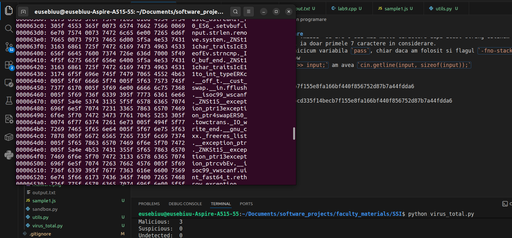

## Lab 1

#### General information

A - 3
B - 1
C - 5
D - 2
E - 4


#### Security mindset

- Very insightful
- A bit too abstract, but that's intended
- I prefer to build projects, not read books - get your hands dirty


#### Number systems

- 23 + 10 -> 0b100010
- 0xa3f5 -> 0b1010001111110101
- https://www.rapidtables.com/convert/number/base-converter.html


#### ASCII

- 69 85 83 69 66 73 85 -> EUSEBIU
- 66 82 65 86 79 -> BRAVO


#### Base64

- EUSEBIU -> RVVTRUJJVQ==
- Sunt student la FMI.


#### Introduction in Security

- malware: software that has the role of entering the people's computers to steal their data or identity and causing damage to other software in that system
- virus: a type of malware that has the ability to spread among the victim's devices by inserting itself (or parts of itself) in other software programs
- dropper: a type of trojan who enters the system disguised as a normal program (in the same way tricking also the anti-malware softwares) and unwrap itself once it gets access to resources to execute malicious code
- downloader: a type of dropper that, once it enters the system, it download malicious resources and code from the internet
- trojan horse: a type of malware that tricks the system into thinking it's a legitimate process
- spyware: a software that is secretly injected into an individual's or organisation's computer to gather information without their knowledge
- riskware: a type of program that holds potential risks to the host machine after it's downloaded and run; eg.: remote desktop access
- ransomware: malware that encrypts the, once installed, encrypts the user's information so the owner cannot access it anymore, unless it pays a sum of money (ransom), usually in form of crypto-currencies
- adware: a piece of software that renders advertisements on the user's computers, generating revenue and tracking user's actions
- worm: malware that, once install on a computer, it knows how to corrupt it without external guidance or host program intervention, replicating by itself across the system
- obfuscation: process of hiding user PII by encryption to make it difficult to understand


## Lab 2

#### General Information

A - 4
B - 6
C - 2
D - 1
E - 5
F - 3


#### C-I-A

1 - C
2 - A
3 - I
4 - C, I
5 - I

#### Encryption Systems

**Pigpen Substitution System**


- The security of the encryption is pretty solid since it cannot be broken by a classic computer due to the large number of possibilities ($26!$). Still, given a large amount of data encoded with this encryption, we can easily break it by letter frequency analysis knowing the encoded language.

**Caesar Cipher**

- The encryption security of this type of encoding is quite easy to understand and simulate, but even easier for a computer to break since it requires at most only 26 trails until a solution is found; given the fact that exactly 1 of those 26 solutions make sense, one can take a portion of the text, try all the possibilities and check manually if the selected statement makes sense.
- INFORMATICA -> (k = 2) KPHQTOCVKEC


#### Frequency Analysis

```
ALICE AND BOB ARE THE WORLDS MOST FAMOUS CRYPTOGRAPHIC COUPLE. SINCE
THEIR INVENTION IN 1978, THEY HAVE AT ONCE BEEN CALLED INSEPARABLE, AND
HAVE BEEN THE SUBJECT OF NUMEROUS DIVORCES, TRAVELS, AND TORMENTS. IN THE
ENSUING YEARS, OTHER CHARACTERS HAVE JOINED THEIR CRYPTOGRAPHIC FAMILY.
THERES EVE, THE PASSIVE AND SUBMISSIVE EAVESDROPPER, MALLORY THE MALICIOUS
ATTACKER, AND TRENT, TRUSTED BY ALL, JUST TO NAME A FEW. WHILE ALICE, BOB, AND
THEIR EXTENDED FAMILY WERE ORIGINALLY USED TO EXPLAIN HOW PUBLIC KEY
CRYPTOGRAPHY WORKS, THEY HAVE SINCE BECOME WIDELY USED ACROSS OTHER
SCIENCE AND ENGINEERING DOMAINS. THEIR INFLUENCE CONTINUES TO GROW
OUTSIDE OF ACADEMIA AS WELL: ALICE AND BOB ARE NOW A PART OF GEEK LORE, AND
SUBJECT TO NARRATIVES AND VISUAL DEPICTIONS THAT COMBINE PEDAGOGY
WITH IN-JOKES, OFTEN REFLECTING OF THE SEXIST AND HETERONORMATIVE
ENVIRONMENTS IN WHICH THEY WERE BORN AND CONTINUE TO BE USED. MORE THAN
JUST THE WORLDS MOST FAMOUS CRYPTOGRAPHIC COUPLE, ALICE AND BOB HAVE
BECOME AN ARCHETYPE OF DIGITAL EXCHANGE, AND A LENS THROUGH WHICH TO VIEW
BROADER DIGITAL CULTURE. Q.DUPONT AND A.CATTAPAN CRYPTOCOUPLE
```


#### Enigma Machine

- 9 mar - V, I, II - UTC - EQL
- EUSEBIU -> DRUFKSG
- DRUFKSG -> EUSEBIU
- EUUFKSG -> DRSEBIU
- TTTTTTT -> no letter in EUSEBIU or its encryption has letter T; besides this, if you replace any pair of the EUSEBIU letters it's obvious that you'll get a different word then EUSEBIU; that's because letters are in pairs - if you write D as the first letter and with that configuration you will surely get E (and viceversa); but if you write another letter you will get a different one (different from E, D and probably than the inserted letter)


## Lab 3

#### Decryption of Text

**1. Find text**
- Binary of base64 text:

```
10100011110111111110010010000100001011011100111101111111011111111111110100001011001000110100001001101101110111001100011100111111001011100110100010100010101101110001110000010001101011000001100101001000010110110111011110011010000000001010001001110001000110011110001010000100001101001000110011110000111001101110000110010110100111011110111110111110001000000001010110111000000101101110001000111010110100001001001011001111101010000110111010110000000101011010101010000101111100010111010001000011111111110000010001100111111011101010001000100011110100101011001010000000001111011110000100000001111100010110000010011111001111001010111111110111
```

- Binary of hex text:

```
11101100101100011000000110100100011110011010011000010010000110101101110101011011010000100010011001001101101110011011010001001011010010110100100011010111110110010011110001100010110001010110101000111100001111100001101010111010011001001100011101010001011110101001000011101101010001001111100010010001100101001000010010110110111011011000101011001100010001100111000011011011011000101100001001001001101110011111010110111010110110100100111011010100011101001100100111100100110100010001000100110000100010110110000101000111100010001100110101001111101111011100000111101001010010011100000101100010100111100001001011111010010111111101101111011001
```

- XOR:

```
01001111011011100110010100100000010101000110100101101101011001010010000001010000011000010110010000100000011001010111001101110100011001010010000001110101011011100010000001110011011010010111001101110100011001010110110100100000011001000110010100100000011000110111001001101001011100000111010001100001011100100110010100100000011100000110010101110010011001100110010101100011011101000010000001110011011010010110011101110101011100100010000001100100011000010110001101100001001000000110010101110011011101000110010100100000011001100110111101101100011011110111001101101001011101000010000001100011011011110111001001100101011000110111010000101110
```

- Rezultat:

```
One Time Pad este un sistem de criptare perfect sigur daca este folosit corect.
```

**2. Find key**

```
0xECAD8DE748EF0B1A857F032101BDB51F5E07C3C37931C37B3C3219EF748215708CF046A18588C1E2F897CA0076CA7F924EB1E6EFCB1B905AFED5D110228D24049B8242BEC6E11D82699409FA1281D9
```

**3. Reusing keys**

- Refolosind cheia de la pct 1, vom compromite securitatea sistemului: un user trimite mesajul $M$, obtine mesajul $M \bigoplus K = E$. In cazul in care poate obtine acest $E$, cheia este aflata folosind proprietatea de simetrie a XOR-ului, si astfel, atacatorul poate decripta orice mesaj din sistem

#### Two Time Pad

00000111 = m1 XOR K
01000001 = m2 XOR K
01000110 = R = m1 XOR m2

Dat fiind faptul ca bitul 6 (0-indexed) este setat ca 1 iar toate literele englezesti in codul ASCII au, de asemenea, acel bit setat (litere mici si mari), putem concluziona ca fie m1 fie m2 este un spatiu (altfel, bit-ul ar fi fost 0 caci 1 XOR 1 = 0). Stiind acest lucru, avem ca m1 este " " si m2 = chr(R XOR 32) = chr(102) = "f", sau viceversa.

#### Three Time Pad

01100110 = m1
00110010 = m2
00100011 = m3

01010100 = m1 XOR m2 = R1
00010001 = m2 XOR m3 = R2
01000101 = m1 XOR m3 = R3

Analog rationamentului anterior, cum putem observa ca R1 si R3 au bit-ul 6 setat ca 1, iar m1 este in ambele, avem ca m1 este " ". De aici obtinem ca m2 = "t" si m3 = "e"


#### Brute-force Attack

- $2^256$ chei
- $\frac{2^256}{2^30} = 2^226 sec \approx 2^200 years$
- Chiar daca am aveam paralelism si supercalculatoare, nu ar fi posibila spargerea sistemului... decat daca am folosi un calculator cuantic ;)


## Lab 4

#### Notiuni Generale

```
A - 4
B - 2
C - 1
D - 3
E - 6
F - 5
```

#### Phishing attacks

- Indicii: sender address, typos, suspicios link preview


## Lab 5

#### Analiza statica si dinamica

**Ex 1**

- Codul atasat este un exemplu de Obfuscated JavaScript, ce foloseste JJEncode
- scriptul este un cod de javascrypt care la rulare afiseaza mesajul:
```
Facultatea de Matematica si Informatica
Universitatea din Bucuresti
https://www.youtube.com/watch?v=HIcSWuKMwOw
```
- am dezarhivat fisierul si l-am introdus in https://jdoodle.com/execute-nodejs-online iar acesta a fost mesajul
- Yosuke Hasegawa a fost creatorul jjencode

**Ex 2**

- tehnica de ofuscare numita Dean Edwards Packer, care ascunde executia unui program malitios printr-un string (keyword-urile inlocuiesc cuvintele string-ului)
- Decodificare
```js
WScript.Echo("You have been hacked!");
WScript.Echo("I hope you did not run this on your own PC...");
var Facultatea = "fmi";
var mi = "de Matematica si Informatica";
var unibuc = "Universitatea din Bucuresti";
var curs = "Curs CTI anul 4";
var minciuna = "Acesta este un malware. Dispozitivul este compromis";
var anterior = "Stringul anterior este o minciuna";

try {
    var obj = new ActiveXObject("Scripting.FileSystemObject");
    var out = obj.OpenTextFile("./fmi.txt", 2, true, 0);
    out.WriteLine("Bun venit la acest laborator :)");
    out.Close();
    var fle = obj.GetFile("./fmi.txt");
    fle.attributes = 2; // Setează atributul "Hidden"
} catch (err) {
    WScript.Echo("Do not worry. Ghosts do not exist!");
}
```
- este malware deoarece avem obfuscare si manipulare a fisierelor fara permisiuni


**Ex 3**

- Scriptul este un Downloader care realizeaza obfuscare, conexiune la retea, accesarea sistemului de fisiere si executie
- Da, se poate obtine codul fara rulare daca se schimba functia de executie cu `console.log()`
- Da, acest script prezinta toate caracteristicile unui Dropper
- Comparatie Virus Total
  - https://www.virustotal.com/gui/file/a196ea13937f9b858c9fb2a56eecf139d324a022cbd21adcc217f7e581a73e21
  - https://www.virustotal.com/gui/file/4d6bd936cb25a2111392b84ba13077bd87c24309e57ae8c2f99141197776278d


### Lab 6

1. candidatul 1 va da return la final un string de 0
candidatul 3 nu poate sa returneze un sir de biti random, tot ce face este o functie de truncare fara sa genereze o secventa, doar filtreaza input-ul

2.
a.
in codul de java seed-ul este acelasi tot timpul, asta inseamna ca indiferent de functie, la rularea programului va fi mereu aceeasi secventa
in codul de php se foloseste userID ca seed ceea ce inseamna ca un atacator poate sa ia user-id-ul si sa isi faca singur seed-ul ceea ce duce la session hijacking

b. 
CWE-337 predictible seed
CWE-330 Use of insufficiently Random Values

c. 
daca spatiul seed-urilor este mic atunci devine valida folosirea atacului Brute Force id:CWE-334: Small Seed Space

d. 
CAPEC-59: Session Credential Forgery thorugh Prediction
Seed-ul este mentionat in contextul in care daca atacatorul indentifica PRNG-ul aceste poate sa dea brute force la seed-uri pana gaseste unul care se potriveste

e.
CWE-338: -Use of Cryptographically weak Pseudo-Random Number Generator

CVE - 2019 - 12181 Un caz in care se folosea un rand() in C care este predictibil
CVE -2021 -41184 Un caz in care Framework-ul Prism genera numere aleatorii, facilitand atacuri asupra token-urilor

f. Am gasit 5 majore anul acesta majoritatea fiind predictible seed sau weak PRNG


## Lab 9

- Hex editor: editor that is able to make CRUD operations on binary code (that is written in hex)
- Portable executor: Portable Executable (PE) is a file format for native executable code on 32-bit and 64-bit Windows operating systems, as well as in UEFI environments (firmware that is executed when the computer starts). It is used for native executables (.exe, .com), dynamic link libraries (.dll, .ocx), system drivers (.sys, .drv) and many other types of files.
- List of files signatures: A file signature is data used to identify or verify the content of a file. Such signatures are also known as magic numbers or magic bytes and are usually inserted at the beginning of the file. The list is available here: https://en.wikipedia.org/wiki/List_of_file_signatures

#### Vulnerabilitati introduse prin programare

- Daca incercam ceva diferit de "fmiSSI" si care nu incepe cu acest string obtinem "Ati introdus o parola gresita :("
- Daca incercam cu un string care incepe cu "fmiSSI" si are 0 sau mai multe caractere dupa acest string obtinem "Parola introdusa este corecta!" pentru ca programul ia doar primele 7 caractere in considerare.
- Din nefericire nu am putut sa suprascriu nicicum variabila `pass`, chiar daca am folosit si flagul `-fno-stack-protector`
- Vulnerabilitatea se numeste Buffer Overflow
- Codul se poate repara daca in loc de `cin >> input;` am avea `cin.getline(input, sizeof(input));`


#### Detectia fisierelor pe baza valorii hash

- Ne facem cont pe virus total si apoi luam API_KEY-ul si il punem intr-un fisier `.env`, ca o variabila cu numele `VT_API_KEY`

```py
import hashlib
import requests
import os
from dotenv import load_dotenv

# Încărcăm variabilele din fișierul .env
load_dotenv()

def get_sha256(file_path):
    """Calculează hash-ul SHA256 al unui fișier."""
    sha256_hash = hashlib.sha256()
    try:
        with open(file_path, "rb") as f:
            for byte_block in iter(lambda: f.read(4096), b""):
                sha256_hash.update(byte_block)
        return sha256_hash.hexdigest()
    except FileNotFoundError:
        print(f"Eroare: Fișierul '{file_path}' nu a fost găsit.")
        return None

def check_virustotal(file_hash, api_key):
    """Interoghează VirusTotal API v3 folosind hash-ul."""
    if not api_key:
        print("Eroare: Cheia API nu a fost găsită în fișierul .env")
        return

    url = f"https://www.virustotal.com/api/v3/files/{file_hash}"
    headers = {
        "accept": "application/json",
        "x-apikey": api_key
    }

    response = requests.get(url, headers=headers)

    if response.status_code == 200:
        data = response.json()
        stats = data['data']['attributes']['last_analysis_stats']
        
        print("-" * 30)
        print(f"Rezultate VirusTotal pentru: {file_hash}")
        print(f"Malicious:   {stats['malicious']}")
        print(f"Suspicious:  {stats['suspicious']}")
        print(f"Undetected:  {stats['harmless']}")
        print(f"Total scanări: {sum(stats.values())}")
        print("-" * 30)
    elif response.status_code == 404:
        print("\n[!] Hash-ul nu există în baza de date VirusTotal (fișierul nu a mai fost scanat).")
    elif response.status_code == 401:
        print("\n[!] Eroare: Cheie API invalidă.")
    else:
        print(f"\nEroare API: {response.status_code}")

if __name__ == "__main__":
    # Citim cheia din variabila de mediu încărcată anterior
    api_key = os.getenv("VT_API_KEY")
    
    # Programul de la ex 1
    nume_fisier = "malware.png" 
    
    hash_rezultat = get_sha256(nume_fisier)
    
    if hash_rezultat:
        print(f"SHA256 calculat: {hash_rezultat}")
        check_virustotal(hash_rezultat, api_key)
```

- Din programul de python obtinem
```
SHA256 calculat: dbd3b32b7327855cd335f14becb7f155e8fa166bf440f856752d87b7a44fdda6
------------------------------
Rezultate VirusTotal pentru: dbd3b32b7327855cd335f14becb7f155e8fa166bf440f856752d87b7a44fdda6
Malicious:   3
Suspicious:  0
Undetected:  0
Total scanări: 75
------------------------------
```

#### Timestamps



- Comanda: `cd "/home/eusebiuu/Documents/software_projects/faculty_materials/SSI/" && g++ -std=c++20 -Wshadow -Wall -g -fsanitize=undefined -D_GLIBCXX_DEBUG -DONPC lab9.cpp -o lab9 && ./lab9`


## Lab 10

#### 1. Factorizarea modulului RSA

Prin aplicarea unui algoritm de factorizare asupra valorii N (Pollard's rho sau Quadratic Sieve):
N=234841136411758273000763594354834942653

p=15159103987034177421
q=15491755716174771703

Calcularea funcției Totient ϕ(N)

Funcția ϕ(N) este necesară pentru a găsi exponentul privat d. Formula este:
ϕ(N)=(p−1)⋅(q−1)

ϕ(N)=(15159103987034177420)⋅(15491755716174771702)
ϕ(N)=234841136411758273000763594354834942653−(p+q)+1
ϕ(N)=234841136411758272970112733251025993532

Exponentul privat d este inversul multiplicativ al lui e modulo ϕ(N). Acesta trebuie să satisfacă ecuația:
e⋅d≡1(modϕ(N))

Folosind Algoritmul lui Euclid Extins pentru e=65537 și valoarea ϕ(N) calculată anterior, obținem:

d=127907572790938637255142106362702704337

Această sarcină demonstrează de ce lungimea cheii contează. Un modul de 128 biți oferă protecție zero în fața atacurilor moderne. Standardele actuale recomandă chei de cel puțin 2048 biți pentru a asigura securitatea datelor împotriva factorizării.

#### 2. Generarea cheilor RSA folosind OpenSSL

- Generarea cheii RSA: `openssl genrsa -out alice_sk.pem 2048`
- În OpenSSL, valoarea implicită pentru exponentul public (e) este 65537 (în hexazecimal: 0x10001). Această valoare este aleasă deoarece este un număr prim Fermat (F4​), ceea ce face operațiile de criptare și verificare a semnăturii foarte eficiente din punct de vedere computațional, menținând în același timp un nivel ridicat de securitate.
- Decodarea cheii și extragerea valorilor: `openssl rsa -in alice_sk.pem -text -noout`

```
modulus:
    00:db:03:e0:77:da:46:51:65:14:6b:e2:cb:5b:5a:
    f2:bd:34:0d:77:0e:77:d9:5c:22:2a:92:4e:ff:b5:
    a3:e6:db:6a:d5:ef:76:7b:99:27:32:7e:f8:1c:a2:
    a9:c0:a4:6f:40:bf:f9:f6:c9:7e:80:cf:09:b9:39:
    59:06:ee:85:03:58:20:78:4f:39:54:79:ba:d8:b9:
    2b:35:3f:a5:47:56:84:db:2f:96:21:02:52:61:0e:
    f5:ec:a3:4d:17:9d:36:f9:a6:5c:fa:b4:b1:cd:75:
    36:70:65:fe:05:98:dd:ec:6a:6f:c9:70:16:77:6d:
    3d:e8:3b:2a:d1:e8:f1:07:f6:47:59:53:37:9c:35:
    4f:e5:12:aa:d1:55:ae:4f:3f:6a:92:00:e7:dc:3a:
    24:df:e7:ad:2f:a0:6a:9b:59:1a:55:7c:69:fc:ea:
    b5:c6:d8:bb:8a:eb:3a:34:8d:05:44:11:a8:b0:8c:
    92:94:46:b8:75:39:d2:59:b4:7d:69:2e:2d:80:68:
    c2:79:e6:6a:93:fd:f7:b4:0a:9f:da:93:62:9d:4a:
    6d:e0:5c:09:10:e0:63:11:64:b7:bb:a9:d1:c6:aa:
    fd:58:e6:28:6c:8a:0d:79:3e:c7:8f:a4:cd:8c:71:
    4d:02:8d:08:85:c3:1a:69:b8:55:07:5a:2d:03:56:
    9c:1b
prime1:
    00:eb:51:d4:04:17:04:20:5e:c3:1f:06:d3:e6:e4:
    e1:ac:18:25:02:32:1d:fd:21:68:e6:d9:69:bc:85:
    15:fa:a8:c4:7b:fe:5e:df:ee:bb:55:d9:ba:e3:22:
    38:6c:d6:12:b0:4c:94:f2:23:c6:20:a6:79:6a:21:
    61:c4:47:b3:f9:04:63:be:f8:40:92:01:de:04:18:
    32:c3:bc:f0:39:46:30:d7:cc:bd:5d:2a:7f:d7:92:
    59:d3:a7:96:f8:02:3f:7c:65:60:2a:5e:74:a0:8c:
    89:74:76:31:d8:51:0a:92:9d:ea:c8:0e:96:38:f2:
    ea:a6:eb:50:33:12:b2:8a:41
prime2:
    00:ee:43:3b:c5:ab:db:6e:09:55:a6:e0:f7:3a:47:
    fa:79:01:65:0f:dc:85:d6:3c:2a:21:20:b3:b3:cb:
    f9:4e:bf:47:44:bb:4e:4b:aa:7c:14:49:9c:3e:0f:
    b2:b0:8a:2a:a0:2a:23:9f:d9:4d:69:b5:5a:4d:1e:
    96:ca:ba:d4:7c:32:16:4e:2e:c1:9d:d4:73:4e:90:
    29:62:a0:6f:a4:d0:3c:e0:9c:f4:f4:96:08:f0:e7:
    82:24:82:71:9e:bf:37:1b:c5:8e:db:b1:1b:71:14:
    7b:38:a2:f3:4d:3c:68:d2:1f:36:86:dd:58:d9:ed:
    b9:63:02:f2:72:3c:4b:b7:5b
```

- Generare cheie securizata pentru Alice: `openssl genrsa -aes256 -out alice_sk_protected.pem 2048`
- Diferențe și Decodare:
  - Vizual: Dacă deschizi fișierul alice_sk.pem (cel neprotejat) cu un editor de text, vei vedea doar header-ul și cheia Base64. Fișierul protejat alice_sk_protected.pem conține în header informații despre algoritmul de criptare (ex: DEK-Info: AES-256-CBC,...).
  - Acces: Nu poți folosi sau vizualiza cheia protejată fără a introduce parola.
  
- Analiza exponentului de criptare

Valoarea rămâne aceeași: 65537.

Observații și impact asupra securității:

    Impactul: Utilizarea valorii e=65537 nu impactează negativ securitatea în mod practic. Deși este o valoare mică față de N, este suficient de mare pentru a preveni atacurile matematice simple (cum ar fi atacul rădăcinii cubice care ar putea apărea dacă e=3).

    Eficiență: Alegerea lui 65537 (care are doar doi biți setați în format binar: 216+1) permite realizarea criptării prin doar 17 operații de înmulțire, făcând RSA foarte rapid pentru utilizatorul care criptează sau verifică o semnătură.

    Concluzie: Securitatea RSA se bazează pe dificultatea factorizării lui N și pe păstrarea secretă a lui d, nu pe complexitatea lui e.

    [!IMPORTANT]
    În timp ce e poate fi public și mic, exponentul privat d trebuie să fie întotdeauna de o mărime comparabilă cu N pentru a preveni atacurile de tip Wiener's attack.


#### 4. Noțiuni introductive – Semnaturi digitale

- Cine a emis certificatul?: Let's Encrypt
- Validitatea certificatului:
Validity
Not Before
Mon, 27 Apr 2026 02:38:14 GMT
Not After
Sun, 26 Jul 2026 02:38:13 GMT
- Pe câți biți este definită cheia publică?: 2048
- Care este valoarea exponenților de criptare din certificat și din certificatele care îl atestă
în lanț? Ce observați? Are aceasta impact asupra securității?

Dacă analizezi certificatul site-ului și certificatele din lanțul de încredere (Intermediate CA și Root CA), vei observa un numitor comun.

Valoarea exponentului (e):

    În certificatul fmi.unibuc.ro: 65537 (0x10001).

    În certificatul Intermediate (GEANT/Sectigo): 65537.

    În certificatul Root (USERTrust sau AAA Certificate Services): 65537.

Ce observăm?
Aproape toate certificatele digitale din lume folosesc aceeași valoare pentru exponentul public: 216+1=65537.

Are aceasta impact asupra securității?

    Securitate: Nu are un impact negativ direct. Deși 65537 este mic în comparație cu modulul N, este un număr prim care previne atacurile matematice cunoscute asupra exponenților foarte mici (cum ar fi e=3).

    Eficiență: Motivul principal pentru alegerea acestei valori este viteza. Deoarece are doar doi biți de 1 în format binar, operația de ridicare la putere (necesară pentru verificarea semnăturii sau criptare) necesită doar 17 înmulțiri.

    Standardizare: Utilizarea unei valori fixe și sigure ajută la interoperabilitatea dintre diferite browsere și sisteme de operare.

    [!NOTE]
    Securitatea certificatului nu stă în "secretul" lui e (care este public prin definiție), ci în dificultatea de a găsi exponentul privat d prin factorizarea numărului N. Atâta timp cât N are 2048 biți, utilizarea lui 65537 este considerată perfect sigură.


